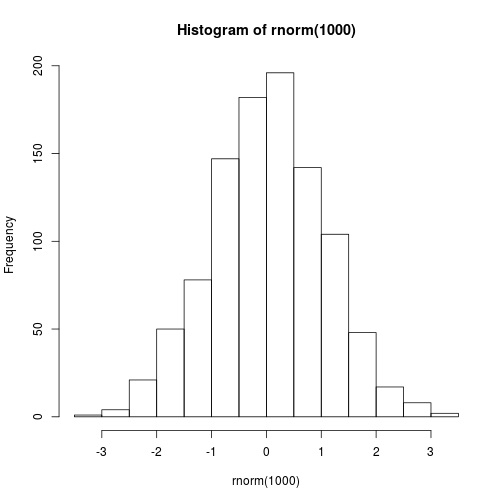
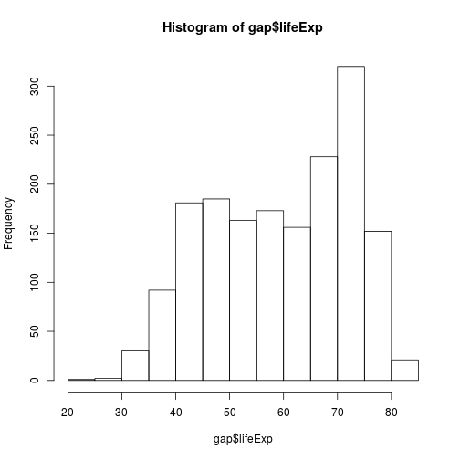
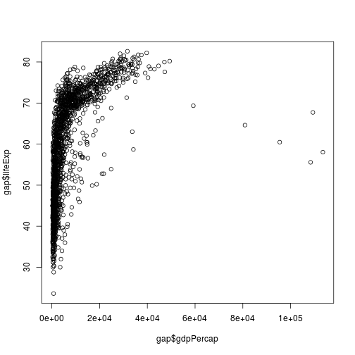
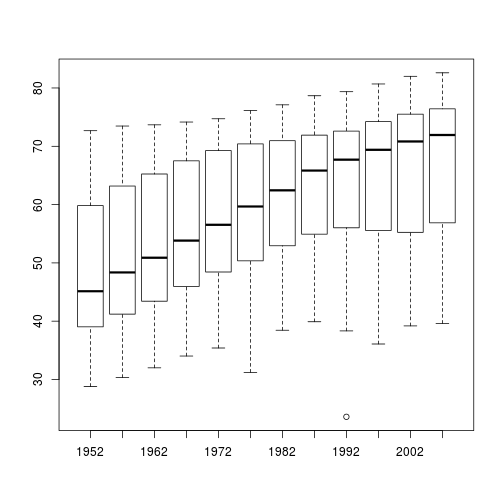
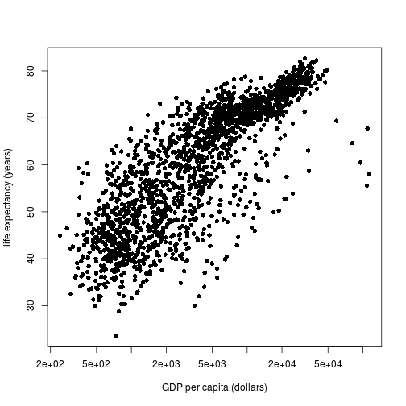

% R bootcamp, Module 1: Basics
% January 2019, UC Berkeley
% Chris Paciorek


# R as a calculator


```r
2 + 2 # add numbers
```

```
## [1] 4
```

```r
2 * pi # multiply by a constant
```

```
## [1] 6.283185
```

```r
7 + runif(1) # add a random number
```

```
## [1] 7.566254
```

```r
3^4 # powers
```

```
## [1] 81
```

```r
sqrt(4^4) # functions
```

```
## [1] 16
```

```r
log(10)
```

```
## [1] 2.302585
```

```r
log(100, base = 10)
```

```
## [1] 2
```

```r
23 %/% 2 
```

```
## [1] 11
```

```r
23 %% 2
```

```
## [1] 1
```

```r
# scientific notation
5000000000 * 1000
```

```
## [1] 5e+12
```

```r
5e9 * 1e3
```

```
## [1] 5e+12
```

Think of a mathematical operation you need - can you guess how to do it in R?

Side note to presenter: turn off R Notebook inline view via RStudio -> Preferences -> R Markdown -> Show output inline ...

# Assigning values to R objects

A key action in R is to store values in the form of R objects, and to examine the value of R objects.


```r
val <- 3
val
```

```
## [1] 3
```

```r
print(val)
```

```
## [1] 3
```

```r
Val <- 7 # case-sensitive!
print(c(val, Val))
```

```
## [1] 3 7
```

We can work with (and store) sequences and repetitions

```r
mySeq <- 1:6
mySeq
```

```
## [1] 1 2 3 4 5 6
```

```r
years <- seq(1952, 2007, by = 5)
years
```

```
##  [1] 1952 1957 1962 1967 1972 1977 1982 1987 1992 1997 2002 2007
```

```r
length(years)
```

```
## [1] 12
```

```r
country <- rep("Afghanistan", 12)
country 
```

```
##  [1] "Afghanistan" "Afghanistan" "Afghanistan" "Afghanistan" "Afghanistan"
##  [6] "Afghanistan" "Afghanistan" "Afghanistan" "Afghanistan" "Afghanistan"
## [11] "Afghanistan" "Afghanistan"
```

```r
## This is a comment: here is an example of non-numeric data
countries <- c("Afghanistan", "India", "Pakistan")
countries
```

```
## [1] "Afghanistan" "India"       "Pakistan"
```

If we don't assign the output of a command to an object, we haven't saved it for later use.

R gives us a lot of flexibility (within certain rules) for assigning to (parts of) objects from (parts of) other objects.

# How to be [lazy](http://dilbert.com/strips/comic/2005-05-29/)

If you're starting to type something you've typed before, or the long name of an R object or function, STOP!  You likely don't need to type all of that.

- Tab completion
- Command history 
    * up/down arrows
    * Ctrl-{up arrow} or Command-{up arrow}
- RStudio: select a line or block for execution
- Put your code in a file and use `source()`. For example: `source('myRcodeFile.R')`

**Question**: Are there other tricks that anyone knows of?

# Vectors in R

The most basic form of an R object is a vector. In fact, individual (scalar) values are vectors of length one. 

We can concatenate values into a vector with `c()`.


```r
## numeric vector
nums <- c(1.1, 3, -5.7)
devs <- rnorm(5)
devs
```

```
## [1]  1.7604693  1.1289703 -0.4925867 -1.3464236  1.2158977
```

```r
## integer vector
ints <- c(1L, 5L, -3L) # force storage as integer not decimal number
## 'L' is for 'long integer' (historical)

nObs <- 1000
mySample <- sample(1:1000, 100, replace = TRUE)

## character vector
chars <- c('hi', 'hallo', "mother's", 'father\'s', 
   "She said, 'hi'", "He said, \"hi\"" )
chars
```

```
## [1] "hi"              "hallo"           "mother's"        "father's"       
## [5] "She said, 'hi'"  "He said, \"hi\""
```

```r
cat(chars, sep = "\n")
```

```
## hi
## hallo
## mother's
## father's
## She said, 'hi'
## He said, "hi"
```

```r
## logical vector
bools <- c(TRUE, FALSE, TRUE)
bools
```

```
## [1]  TRUE FALSE  TRUE
```

# Working with indices and subsets


```r
vals <- seq(2, 12, by = 2)
vals
```

```
## [1]  2  4  6  8 10 12
```

```r
vals[3]
```

```
## [1] 6
```

```r
vals[3:5]
```

```
## [1]  6  8 10
```

```r
vals[c(1, 3, 6)]
```

```
## [1]  2  6 12
```

```r
vals[-c(1, 3, 6)]
```

```
## [1]  4  8 10
```

```r
vals[c(rep(TRUE, 3), rep(FALSE, 2), TRUE)]
```

```
## [1]  2  4  6 12
```

```r
#######################################################################
## IMPORTANT: read in the Gapminder dataset from disk;
## first make sure your working directory is the 'modules' directory
getwd()
```

```
## [1] "/accounts/gen/vis/paciorek/staff/workshops/r-bootcamp-winter-2019/modules"
```

```r
## if the result is not the 'modules' subdirectory of the bootcamp
## directory, set the working directly along the lines of this:
##
## setwd('/Users/paciorek/Desktop/r-bootcamp-winter-2019/modules')
##
## replace '/Users/paciorek/Desktop' with whatever directory you put the bootcamp
## materials in; e.g. on Windows it might be something like
## 'C:\\Users\\sarah\\r-bootcamp-winter-2019\\modules'
##
## If you've done that correctly, then the next command reads
## in the dataset from the 'data' directory. In the next
## command R finds that directory relative to the current
## working directory.
gap <- read.csv("../data/gapminder-FiveYearData.csv",
          stringsAsFactors = FALSE)
#######################################################################

## create a simple vector from the Gapminder dataset
gdp <- gap$gdpPercap
gdp[1:10]
```

```
##  [1] 779.4453 820.8530 853.1007 836.1971 739.9811 786.1134 978.0114
##  [8] 852.3959 649.3414 635.3414
```
We can substitute values into vectors

```r
gdp[4] <- 822.9711

vals <- rnorm(100)
vals[1:2] <- 0

## How does R process these next subset operations?
vals[vals < 0] <- 0
vals[1:8]
```

```
## [1] 0.0000000 0.0000000 0.0000000 0.4581328 0.4578595 0.0000000 0.0000000
## [8] 1.0026109
```

```r
wealthy <- gdp[gdp > 100000]
gdp[1:10]
```

```
##  [1] 779.4453 820.8530 853.1007 822.9711 739.9811 786.1134 978.0114
##  [8] 852.3959 649.3414 635.3414
```

# Vectorized calculations and comparisons

At the core of R is the idea of doing calculations on entire vectors.


```r
gdpTotal <- gap$gdpPercap * gap$pop

tmp <- gdpTotal[gap$year == "2007"]
gdpSubset <- tmp[1:20]

gdpSubset >= 1e6  # Dr. Evil's version of "a lot"
```

```
##  [1] TRUE TRUE TRUE TRUE TRUE TRUE TRUE TRUE TRUE TRUE TRUE TRUE TRUE TRUE
## [15] TRUE TRUE TRUE TRUE TRUE TRUE
```

```r
vec1 <- rnorm(5)
vec2 <- rnorm(5)
vec1 > vec2
```

```
## [1] FALSE  TRUE FALSE  TRUE FALSE
```

```r
vec1 == vec2
```

```
## [1] FALSE FALSE FALSE FALSE FALSE
```

```r
vec1 != vec2
```

```
## [1] TRUE TRUE TRUE TRUE TRUE
```

```r
## careful: 
vec1 = vec2
identical(vec1, vec2)
```

```
## [1] TRUE
```

```r
## using 'or'
gdpSubset >= 1e12 | gdpSubset <= 1e10
```

```
##  [1] FALSE FALSE FALSE FALSE FALSE FALSE FALSE FALSE FALSE FALSE FALSE
## [12] FALSE FALSE FALSE  TRUE FALSE FALSE  TRUE FALSE FALSE
```

```r
## using 'and'
gap$lifeExp[1:10] < 75 & gap$continent[1:10] == "Americas"
```

```
##  [1] FALSE FALSE FALSE FALSE FALSE FALSE FALSE FALSE FALSE FALSE
```

# R is a functional language

* Operations are carried out with functions. Functions take objects as inputs and return objects as outputs. 
* An analysis can be considered a pipeline of function calls, with output from a function used later in a subsequent operation as input to another function.
* Functions themselves are objects: 

```r
median
```

```
## function (x, na.rm = FALSE, ...) 
## UseMethod("median")
## <bytecode: 0x32a1ed8>
## <environment: namespace:stats>
```

```r
class(median)
```

```
## [1] "function"
```

```r
median(gap$lifeExp)
```

```
## [1] 60.7125
```

Functions generally take arguments, some of which are often optional:

```r
maxYear <- max(gap$year)
lifeExp <- gap$lifeExp[gap$year == maxYear]
median(lifeExp)
```

```
## [1] 71.9355
```

* We can embed function calls: 

```r
hist(rnorm(1000))
```



# Getting help about a function

To get information about a function you know exists, use `help` or `?`, e.g., `?lm`. For information on a general topic, use `apropos`.


```r
help(lm)
?lm

?log

apropos("mean")
```

# Basic kinds of R objects

Vectors are not the only kinds of R objects.

### Vectors 

Vectors of various types (numeric (i.e., decimal/floating point/double), integer, boolean, character), all items must be of the same type

### Data frames

Collections of columns of potentially different types


```r
head(gap)
```

```
##       country year      pop continent lifeExp gdpPercap
## 1 Afghanistan 1952  8425333      Asia  28.801  779.4453
## 2 Afghanistan 1957  9240934      Asia  30.332  820.8530
## 3 Afghanistan 1962 10267083      Asia  31.997  853.1007
## 4 Afghanistan 1967 11537966      Asia  34.020  836.1971
## 5 Afghanistan 1972 13079460      Asia  36.088  739.9811
## 6 Afghanistan 1977 14880372      Asia  38.438  786.1134
```

```r
dim(gap)
```

```
## [1] 1704    6
```

```r
nrow(gap)
```

```
## [1] 1704
```

```r
names(gap)
```

```
## [1] "country"   "year"      "pop"       "continent" "lifeExp"   "gdpPercap"
```

```r
class(gap)
```

```
## [1] "data.frame"
```

```r
is.matrix(gap)
```

```
## [1] FALSE
```

```r
class(gap$year)
```

```
## [1] "integer"
```

```r
class(gap$lifeExp)
```

```
## [1] "numeric"
```

```r
class(gap$country)
```

```
## [1] "character"
```

### Lists

Collections of disparate or complicated objects


```r
myList <- list(stuff = 3, mat = matrix(1:4, nrow = 2), 
   moreStuff = c("china", "japan"), list(5, "bear"))
myList
```

```
## $stuff
## [1] 3
## 
## $mat
##      [,1] [,2]
## [1,]    1    3
## [2,]    2    4
## 
## $moreStuff
## [1] "china" "japan"
## 
## [[4]]
## [[4]][[1]]
## [1] 5
## 
## [[4]][[2]]
## [1] "bear"
```

```r
myList[[1]] # result is not (usually) a list (unless you have nested lists)
```

```
## [1] 3
```

```r
identical(myList[[1]], myList$stuff)
```

```
## [1] TRUE
```

```r
myList$moreStuff[2]
```

```
## [1] "japan"
```

```r
myList[[4]][[2]]
```

```
## [1] "bear"
```

```r
myList[1:3] # subset of a list is a list
```

```
## $stuff
## [1] 3
## 
## $mat
##      [,1] [,2]
## [1,]    1    3
## [2,]    2    4
## 
## $moreStuff
## [1] "china" "japan"
```

```r
myList$newOne <- 'more weird stuff'
names(myList)
```

```
## [1] "stuff"     "mat"       "moreStuff" ""          "newOne"
```

Lists can be used as vectors of complicated objects. E.g., suppose you have a linear regression for each value of a stratifying variable. You could have a list of regression fits. Each regression fit will itself be a list, so you'll have a list of lists.


# Converting between different types of objects

You can use the `as()` family of functions.


```r
ints <- 1:10
as.character(ints)
```

```
##  [1] "1"  "2"  "3"  "4"  "5"  "6"  "7"  "8"  "9"  "10"
```

```r
as.numeric(c('3.7', '4.8'))
```

```
## [1] 3.7 4.8
```

Be careful: R tries to be helpful and convert between types/classes when it thinks it's a good idea. Sometimes it is overly optimistic. 


```r
indices <- c(1.7, 2.3)
ints[indices]
```

```
## [1] 1 2
```

```r
ints[0.999999999]
```

```
## integer(0)
```


# A bit on plotting

R has several different plotting systems:

- *base* graphics
- *lattice* graphics
- *ggplot2* (an add-on package)

We'll see a little bit of *base* graphics here and then *lattice* and *ggplot2* tomorrow in Module 8.


```r
hist(gap$lifeExp)
```



```r
plot(gap$lifeExp ~ gap$gdpPercap)
```



```r
boxplot(gap$lifeExp ~ gap$year)
```



# Graphics options

Check out `help(par)` for various [graphics settings](http://xkcd.com/833/); these are set via `par()` or within the specific graphics command (some can be set in either place), e.g.,

```r
par(pch = 16)
plot(gap$lifeExp ~ gap$gdpPercap, xlab = 'GDP per capita (dollars)',
   ylab = 'life expectancy (years)', log = 'x')
```



# Breakout

In general, your answers to any questions should involve writing code to manipulate objects. For example, if I ask you to find the maximum flight delay, do not scan through all the values and find it by eye. Use R to do the calculations and print results.

### Basics

1) Create a variable called 'x' that contains the mean life expectancy.

2) Use functions in R to round 'x' to two decimal places and to two significant digits.

3) Create a vector of GDP per capita in units of Euros rather than dollars.

4) Create a boolean (TRUE/FALSE) vector indicating whether total country GDP is greater than 1 trillion dollars. When entering 1 trillion, use R's scientific notation.

### Using the ideas

5) Use the boolean vector from problem 4 to produce a new dataset containing the data only from the biggest economies.

6) Plot life expectancy against gdpPercap with gdpPercap values greater than 40000 set to 40000.

7) Make a histogram of the life expectancy values for the year 2007.  Explore the effect of changing the number of bins in the histogram using the 'breaks' argument.

8) Subset the data to those for the year 2007. Plot life expectancy against GDP per capita. Add a title to the plot. Now plot so that data for Asia are in one color and those for all other countries are in another color, usingflights to Chicago are in one color and those for all other continents are in another, using the 'col' argument. 


### Advanced

9) Consider the following regression model.  Figure out how to extract the $R^2$ and residual standard error and store in new R variables. 


```r
mod <- lm(lifeExp ~ log(gdpPercap), data = gap)
summ <- summary(mod)
```

10) Take your plot from problem 8. Now modify the size of the points. Add a legend. Rotate the numbers on the y-axis so they are printed horizontally. Recall that `help(par)` will provide a lot of information.
