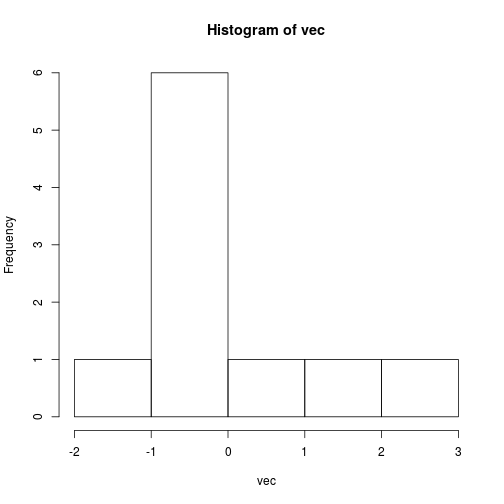
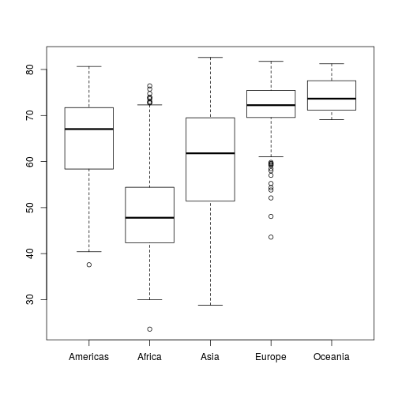

% R bootcamp, Module 3: Working with objects and data
% January 2019, UC Berkeley
% Chris Paciorek


# Matrices and Arrays

If you need to do numeric calculations on an entire non-vector object (dimension > 1), you generally want to use matrices and arrays, not data frames.

- Matrices are two-dimensional collections of values of the same type
- We can have numeric, integer, character, or logical matrices, character matrices.
- You can't mix types within a matrix


```r
mat <- matrix(rnorm(12), nrow = 3, ncol = 4)
mat
```

```
##            [,1]       [,2]       [,3]       [,4]
## [1,] -2.1249552 -0.4180123  0.7825093  0.1209508
## [2,] -0.9027449  1.9308510  0.4292138  0.2174327
## [3,]  1.2976135  1.6412740 -0.1760998 -2.2618083
```

```r
# vectorized calcs work with matrices too
mat*4
```

```
##           [,1]      [,2]       [,3]       [,4]
## [1,] -8.499821 -1.672049  3.1300371  0.4838033
## [2,] -3.610980  7.723404  1.7168553  0.8697309
## [3,]  5.190454  6.565096 -0.7043991 -9.0472330
```

```r
mat <- cbind(mat, 1:3)
mat
```

```
##            [,1]       [,2]       [,3]       [,4] [,5]
## [1,] -2.1249552 -0.4180123  0.7825093  0.1209508    1
## [2,] -0.9027449  1.9308510  0.4292138  0.2174327    2
## [3,]  1.2976135  1.6412740 -0.1760998 -2.2618083    3
```

```r
# Let's convert the gapminder dataframe to a matrix:
gm_mat <- as.matrix(gap[ , c('lifeExp', 'gdpPercap')])
head(gm_mat)
```

```
##      lifeExp gdpPercap
## [1,]  28.801  779.4453
## [2,]  30.332  820.8530
## [3,]  31.997  853.1007
## [4,]  34.020  836.1971
## [5,]  36.088  739.9811
## [6,]  38.438  786.1134
```

```r
# What do you think will happen?
gm_mat <- as.matrix(gap)
head(gm_mat)
```

```
##      country       year   pop          continent lifeExp    gdpPercap    
## [1,] "Afghanistan" "1952" "   8425333" "Asia"    "28.80100" "   779.4453"
## [2,] "Afghanistan" "1957" "   9240934" "Asia"    "30.33200" "   820.8530"
## [3,] "Afghanistan" "1962" "  10267083" "Asia"    "31.99700" "   853.1007"
## [4,] "Afghanistan" "1967" "  11537966" "Asia"    "34.02000" "   836.1971"
## [5,] "Afghanistan" "1972" "  13079460" "Asia"    "36.08800" "   739.9811"
## [6,] "Afghanistan" "1977" "  14880372" "Asia"    "38.43800" "   786.1134"
```

Arrays are like matrices but can have more or fewer than two dimensions.

```r
arr <- array(rnorm(12), c(2, 3, 4))
arr
```

```
## , , 1
## 
##             [,1]       [,2]      [,3]
## [1,]  1.23849852 -0.2372683 0.9478997
## [2,] -0.03302339  0.2337014 0.6885227
## 
## , , 2
## 
##            [,1]       [,2]      [,3]
## [1,] -0.1661863  0.6837635 1.0575009
## [2,]  2.1078836 -0.5617945 0.2695333
## 
## , , 3
## 
##             [,1]       [,2]      [,3]
## [1,]  1.23849852 -0.2372683 0.9478997
## [2,] -0.03302339  0.2337014 0.6885227
## 
## , , 4
## 
##            [,1]       [,2]      [,3]
## [1,] -0.1661863  0.6837635 1.0575009
## [2,]  2.1078836 -0.5617945 0.2695333
```

# Attributes

Objects have *attributes*.


```r
attributes(mat)
```

```
## $dim
## [1] 3 5
```

```r
rownames(mat) <- c('first', 'middle', 'last')
mat
```

```
##              [,1]       [,2]       [,3]       [,4] [,5]
## first  -2.1249552 -0.4180123  0.7825093  0.1209508    1
## middle -0.9027449  1.9308510  0.4292138  0.2174327    2
## last    1.2976135  1.6412740 -0.1760998 -2.2618083    3
```

```r
attributes(mat)
```

```
## $dim
## [1] 3 5
## 
## $dimnames
## $dimnames[[1]]
## [1] "first"  "middle" "last"  
## 
## $dimnames[[2]]
## NULL
```

```r
names(attributes(gap))
```

```
## [1] "names"     "class"     "row.names"
```

```r
attributes(gap)$names
```

```
## [1] "country"   "year"      "pop"       "continent" "lifeExp"   "gdpPercap"
```

```r
attributes(gap)$row.names[1:10]
```

```
##  [1]  1  2  3  4  5  6  7  8  9 10
```

Now let's do a bit of manipulation and see if you can infer how R represents matrices internally.


```r
mat[4]
```

```
## [1] -0.4180123
```

```r
attributes(mat) <- NULL
mat
```

```
##  [1] -2.1249552 -0.9027449  1.2976135 -0.4180123  1.9308510  1.6412740
##  [7]  0.7825093  0.4292138 -0.1760998  0.1209508  0.2174327 -2.2618083
## [13]  1.0000000  2.0000000  3.0000000
```

```r
is.matrix(mat)
```

```
## [1] FALSE
```

**Question**: What can you infer about what a matrix is in R?

**Question**: What kind of object are the attributes themselves? How do I check?

# Matrices are stored column-major

This is like Fortran, MATLAB and Julia but not like C or Python(numpy). 


```r
mat <- matrix(1:12, 3, 4)
mat
```

```
##      [,1] [,2] [,3] [,4]
## [1,]    1    4    7   10
## [2,]    2    5    8   11
## [3,]    3    6    9   12
```

```r
c(mat)
```

```
##  [1]  1  2  3  4  5  6  7  8  9 10 11 12
```
You can go smoothly back and forth between a matrix (or an array) and a vector:

```r
identical(mat, matrix(c(mat), 3, 4))
```

```
## [1] TRUE
```

```r
identical(mat, matrix(c(mat), 3, 4, byrow = TRUE))
```

```
## [1] FALSE
```

This is a common cause of bugs!


# Missing values and other special values

Since it was designed by statisticians, R handles missing values very well relative to other languages.

* `NA` is a missing value

```r
vec <- rnorm(12)
vec[c(3, 5)] <- NA
vec
```

```
##  [1] -0.92232387  1.46135921          NA -0.04929972          NA
##  [6]  2.29366872  0.40062427 -0.17539728 -0.79961066 -1.22702955
## [11] -0.36409692 -0.77856974
```

```r
length(vec)
```

```
## [1] 12
```

```r
sum(vec)
```

```
## [1] NA
```

```r
sum(vec, na.rm = TRUE)
```

```
## [1] -0.1606755
```

```r
hist(vec)
```



```r
is.na(vec)
```

```
##  [1] FALSE FALSE  TRUE FALSE  TRUE FALSE FALSE FALSE FALSE FALSE FALSE
## [12] FALSE
```
Be careful because many R functions won't warn you that they are ignoring the missing values.

* To infinity and beyond

```r
big <- 1e500 
big
```

```
## [1] Inf
```

```r
big + 7
```

```
## [1] Inf
```

* `NaN` stands for Not a Number

```r
sqrt(-5)
```

```
## Warning in sqrt(-5): NaNs produced
```

```
## [1] NaN
```

```r
big - big
```

```
## [1] NaN
```

```r
1/0
```

```
## [1] Inf
```

* `NULL`

```r
vec <- c(vec, NULL) 
vec
```

```
##  [1] -0.92232387  1.46135921          NA -0.04929972          NA
##  [6]  2.29366872  0.40062427 -0.17539728 -0.79961066 -1.22702955
## [11] -0.36409692 -0.77856974
```

```r
length(vec)
```

```
## [1] 12
```

```r
a <- NULL
a + 7
```

```
## numeric(0)
```

```r
a[3, 4]
```

```
## NULL
```

```r
is.null(a)
```

```
## [1] TRUE
```

```r
myList <- list(a = 7, b = 5)
myList$a <- NULL  # works for data frames too
myList
```

```
## $b
## [1] 5
```

`NA` can hold a place but `NULL` cannot.
`NULL` is useful for having a function argument default to 'nothing'. See `help(crossprod)`, which can compute either $X^{\top}X$ or $X^{\top}Y$.  


# Logical vectors

```r
gap2007 <- gap[gap$year == 2007, ]

wealthy <- gap2007$gdpPercap > 35000
healthy <- gap2007$lifeExp > 75

head(wealthy)
```

```
## [1] FALSE FALSE FALSE FALSE FALSE FALSE
```

```r
table(wealthy)
```

```
## wealthy
## FALSE  TRUE 
##   130    12
```

```r
# note the vectorized boolean arithmetic
gap2007[wealthy & healthy, ]
```

```
##              country year       pop continent lifeExp gdpPercap
## 84           Austria 2007   8199783    Europe  79.829  36126.49
## 252           Canada 2007  33390141  Americas  80.653  36319.24
## 420          Denmark 2007   5468120    Europe  78.332  35278.42
## 672  Hong Kong China 2007   6980412      Asia  82.208  39724.98
## 696          Iceland 2007    301931    Europe  81.757  36180.79
## 756          Ireland 2007   4109086    Europe  78.885  40676.00
## 864           Kuwait 2007   2505559      Asia  77.588  47306.99
## 1092     Netherlands 2007  16570613    Europe  79.762  36797.93
## 1152          Norway 2007   4627926    Europe  80.196  49357.19
## 1368       Singapore 2007   4553009      Asia  79.972  47143.18
## 1488     Switzerland 2007   7554661    Europe  81.701  37506.42
## 1620   United States 2007 301139947  Americas  78.242  42951.65
```

```r
gap2007[wealthy | healthy, ]
```

```
##              country year       pop continent lifeExp gdpPercap
## 24           Albania 2007   3600523    Europe  76.423  5937.030
## 60         Argentina 2007  40301927  Americas  75.320 12779.380
## 72         Australia 2007  20434176   Oceania  81.235 34435.367
## 84           Austria 2007   8199783    Europe  79.829 36126.493
## 96           Bahrain 2007    708573      Asia  75.635 29796.048
## 120          Belgium 2007  10392226    Europe  79.441 33692.605
## 252           Canada 2007  33390141  Americas  80.653 36319.235
## 288            Chile 2007  16284741  Americas  78.553 13171.639
## 360       Costa Rica 2007   4133884  Americas  78.782  9645.061
## 384          Croatia 2007   4493312    Europe  75.748 14619.223
## 396             Cuba 2007  11416987  Americas  78.273  8948.103
## 408   Czech Republic 2007  10228744    Europe  76.486 22833.309
## 420          Denmark 2007   5468120    Europe  78.332 35278.419
## 528          Finland 2007   5238460    Europe  79.313 33207.084
## 540           France 2007  61083916    Europe  80.657 30470.017
## 576          Germany 2007  82400996    Europe  79.406 32170.374
## 600           Greece 2007  10706290    Europe  79.483 27538.412
## 672  Hong Kong China 2007   6980412      Asia  82.208 39724.979
## 696          Iceland 2007    301931    Europe  81.757 36180.789
## 756          Ireland 2007   4109086    Europe  78.885 40675.996
## 768           Israel 2007   6426679      Asia  80.745 25523.277
## 780            Italy 2007  58147733    Europe  80.546 28569.720
## 804            Japan 2007 127467972      Asia  82.603 31656.068
## 852       Korea Rep. 2007  49044790      Asia  78.623 23348.140
## 864           Kuwait 2007   2505559      Asia  77.588 47306.990
## 996           Mexico 2007 108700891  Americas  76.195 11977.575
## 1092     Netherlands 2007  16570613    Europe  79.762 36797.933
## 1104     New Zealand 2007   4115771   Oceania  80.204 25185.009
## 1152          Norway 2007   4627926    Europe  80.196 49357.190
## 1164            Oman 2007   3204897      Asia  75.640 22316.193
## 1188          Panama 2007   3242173  Americas  75.537  9809.186
## 1236          Poland 2007  38518241    Europe  75.563 15389.925
## 1248        Portugal 2007  10642836    Europe  78.098 20509.648
## 1260     Puerto Rico 2007   3942491  Americas  78.746 19328.709
## 1272         Reunion 2007    798094    Africa  76.442  7670.123
## 1368       Singapore 2007   4553009      Asia  79.972 47143.180
## 1392        Slovenia 2007   2009245    Europe  77.926 25768.258
## 1428           Spain 2007  40448191    Europe  80.941 28821.064
## 1476          Sweden 2007   9031088    Europe  80.884 33859.748
## 1488     Switzerland 2007   7554661    Europe  81.701 37506.419
## 1512          Taiwan 2007  23174294      Asia  78.400 28718.277
## 1608  United Kingdom 2007  60776238    Europe  79.425 33203.261
## 1620   United States 2007 301139947  Americas  78.242 42951.653
## 1632         Uruguay 2007   3447496  Americas  76.384 10611.463
```

```r
gap2007[wealthy & !healthy, ]
```

```
## [1] country   year      pop       continent lifeExp   gdpPercap
## <0 rows> (or 0-length row.names)
```

```r
# what am I doing here?
sum(healthy)
```

```
## [1] 44
```

```r
mean(healthy)
```

```
## [1] 0.3098592
```

**Question**: What do you think R is doing to do arithmetic on logical vectors?

Tricks with logicals...


```r
identical(healthy & wealthy, as.logical(healthy * wealthy))
```

```
## [1] TRUE
```

```r
identical(healthy | wealthy, as.logical(healthy + wealthy))
```

```
## [1] TRUE
```

# Data frames

A review from Module 1...

- Data frames are combinations of vectors of the same length, but can be of different types
- Data frames are what is used for standard rectangular (record by field) datasets, similar to a spreadsheet
- Data frames are a functionality that both sets R aside from some languages (e.g., Matlab) and provides functionality similar to some statistical packages (e.g., Stata, SAS)


```r
class(gap)
```

```
## [1] "data.frame"
```

```r
head(gap)
```

```
##       country year      pop continent lifeExp gdpPercap
## 1 Afghanistan 1952  8425333      Asia  28.801  779.4453
## 2 Afghanistan 1957  9240934      Asia  30.332  820.8530
## 3 Afghanistan 1962 10267083      Asia  31.997  853.1007
## 4 Afghanistan 1967 11537966      Asia  34.020  836.1971
## 5 Afghanistan 1972 13079460      Asia  36.088  739.9811
## 6 Afghanistan 1977 14880372      Asia  38.438  786.1134
```

```r
str(gap)
```

```
## 'data.frame':	1704 obs. of  6 variables:
##  $ country  : chr  "Afghanistan" "Afghanistan" "Afghanistan" "Afghanistan" ...
##  $ year     : int  1952 1957 1962 1967 1972 1977 1982 1987 1992 1997 ...
##  $ pop      : num  8425333 9240934 10267083 11537966 13079460 ...
##  $ continent: chr  "Asia" "Asia" "Asia" "Asia" ...
##  $ lifeExp  : num  28.8 30.3 32 34 36.1 ...
##  $ gdpPercap: num  779 821 853 836 740 ...
```

# Data frames are (special) lists!


```r
is.list(gap)
```

```
## [1] TRUE
```

```r
length(gap)
```

```
## [1] 6
```

```r
gap[[3]][1:5]
```

```
## [1]  8425333  9240934 10267083 11537966 13079460
```

```r
lapply(gap, class) 
```

```
## $country
## [1] "character"
## 
## $year
## [1] "integer"
## 
## $pop
## [1] "numeric"
## 
## $continent
## [1] "character"
## 
## $lifeExp
## [1] "numeric"
## 
## $gdpPercap
## [1] "numeric"
```

`lapply()` is a function used on lists; it works here to apply the `class()` function to each element of the list, which in this case is each field/column.

# But lists are also vectors!


```r
length(gap)
```

```
## [1] 6
```

```r
someFields <- gap[c(3,5)]
head(someFields)
```

```
##        pop lifeExp
## 1  8425333  28.801
## 2  9240934  30.332
## 3 10267083  31.997
## 4 11537966  34.020
## 5 13079460  36.088
## 6 14880372  38.438
```

```r
identical(gap[c(3,5)], gap[ , c(3,5)])
```

```
## [1] TRUE
```

In general the placement of commas in R is crucial, but here, two different operations give the same result because of the underlying structure of data frames.

# Factors
- A factor is a special data type in R used for categorical data. In some cases it works like magic and in others it is incredibly frustrating. 


```r
## let's read the Gapminder data in using the defaults for `read.csv`
gap <- read.csv(file.path('..', 'data', 'gapminder-FiveYearData.csv'))
class(gap$continent)
```

```
## [1] "factor"
```

```r
head(gap$continent) # What order are the factors in?
```

```
## [1] Asia Asia Asia Asia Asia Asia
## Levels: Africa Americas Asia Europe Oceania
```

```r
levels(gap[["continent"]])  # note alternate way to get the variable
```

```
## [1] "Africa"   "Americas" "Asia"     "Europe"   "Oceania"
```

```r
summary(gap$continent)
```

```
##   Africa Americas     Asia   Europe  Oceania 
##      624      300      396      360       24
```

- What if we don't like the order these are in? Factor order is important for all kinds of things like plotting, analysis of variance, regression output, and more

# Ordering the Factor
- Ordered factors simply have an additional attribute explaining the order of the levels of a factor
- This is a useful shortcut when we want to preserve some of the meaning provided by the order
- Think ordinal data

This example is a bit artificial as 'continent' doesn't really have a natural ordering.


```r
gap$continent2 <- ordered(gap$continent, 
     levels = levels(gap$continent)[c(2,1,3,4,5)])

head(gap$continent2)
```

```
## [1] Asia Asia Asia Asia Asia Asia
## Levels: Americas < Africa < Asia < Europe < Oceania
```

```r
levels(gap$continent2)
```

```
## [1] "Americas" "Africa"   "Asia"     "Europe"   "Oceania"
```

```r
boxplot(lifeExp ~ continent2, data = gap)
```



# Reclassifying Factors
- Turning factors into other data types can be tricky. All factors have an underlying numeric structure.


```r
students <- factor(c('basic','proficient','advanced','basic', 
      'advanced', 'minimal'))
levels(students)
```

```
## [1] "advanced"   "basic"      "minimal"    "proficient"
```

```r
unclass(students)
```

```
## [1] 2 4 1 2 1 3
## attr(,"levels")
## [1] "advanced"   "basic"      "minimal"    "proficient"
```

- Hmmm, what happened?
- Be careful! The best way to convert a factor is to convert it to a character first.


```r
students <- factor(c('basic','proficient','advanced','basic', 
      'advanced', 'minimal'))
score = c(minimal = 3, basic = 1, advanced = 13, proficient = 7) # a named vector
score["advanced"]  # look up by name
```

```
## advanced 
##       13
```

```r
students[3]
```

```
## [1] advanced
## Levels: advanced basic minimal proficient
```

```r
score[students[3]]
```

```
## minimal 
##       3
```

```r
score[as.character(students[3])]
```

```
## advanced 
##       13
```

What went wrong and how did we fix it?  Notice how easily this could be a big bug in your code.

# Subsetting

There are many ways to select subsets in R. The syntax below is useful for vectors, matrices, data frames, arrays and lists.


```r
vec <- gap2007$lifeExp
mat <- matrix(1:20, 4, 5)
rownames(mat) <- letters[1:4]
mat
```

```
##   [,1] [,2] [,3] [,4] [,5]
## a    1    5    9   13   17
## b    2    6   10   14   18
## c    3    7   11   15   19
## d    4    8   12   16   20
```
1) by direct indexing


```r
vec[c(3, 5, 12:14)]
```

```
## [1] 72.301 75.320 65.554 74.852 50.728
```

```r
vec[-c(3,5)]
```

```
##   [1] 43.828 76.423 42.731 81.235 79.829 75.635 64.062 79.441 56.728 65.554
##  [11] 74.852 50.728 72.390 73.005 52.295 49.580 59.723 50.430 80.653 44.741
##  [21] 50.651 78.553 72.961 72.889 65.152 46.462 55.322 78.782 48.328 75.748
##  [31] 78.273 76.486 78.332 54.791 72.235 74.994 71.338 71.878 51.579 58.040
##  [41] 52.947 79.313 80.657 56.735 59.448 79.406 60.022 79.483 70.259 56.007
##  [51] 46.388 60.916 70.198 82.208 73.338 81.757 64.698 70.650 70.964 59.545
##  [61] 78.885 80.745 80.546 72.567 82.603 72.535 54.110 67.297 78.623 77.588
##  [71] 71.993 42.592 45.678 73.952 59.443 48.303 74.241 54.467 64.164 72.801
##  [81] 76.195 66.803 74.543 71.164 42.082 62.069 52.906 63.785 79.762 80.204
##  [91] 72.899 56.867 46.859 80.196 75.640 65.483 75.537 71.752 71.421 71.688
## [101] 75.563 78.098 78.746 76.442 72.476 46.242 65.528 72.777 63.062 74.002
## [111] 42.568 79.972 74.663 77.926 48.159 49.339 80.941 72.396 58.556 39.613
## [121] 80.884 81.701 74.143 78.400 52.517 70.616 58.420 69.819 73.923 71.777
## [131] 51.542 79.425 78.242 76.384 73.747 74.249 73.422 62.698 42.384 43.487
```

```r
gap[c(2,4), 5]
```

```
## [1] 30.332 34.020
```

```r
gap[c(2,4), 'lifeExp']
```

```
## [1] 30.332 34.020
```

```r
rowInd <- c(1, 3, 4)
colInd <- c(2, 2, 1)
elemInd <- cbind(rowInd, colInd)
elemInd
```

```
##      rowInd colInd
## [1,]      1      2
## [2,]      3      2
## [3,]      4      1
```

```r
gap[elemInd]
```

```
## [1] "1952"        "1962"        "Afghanistan"
```

Note the last usage where we give it a 2-column matrix of indices

2) by a vector of logicals


```r
wealthy <- gap$gdpPercap > 50000
gap$gdpPercap[wealthy]
```

```
## [1] 108382.35 113523.13  95458.11  80894.88 109347.87  59265.48
```

```r
gap[wealthy, ]
```

```
##     country year     pop continent lifeExp gdpPercap continent2
## 853  Kuwait 1952  160000      Asia  55.565 108382.35       Asia
## 854  Kuwait 1957  212846      Asia  58.033 113523.13       Asia
## 855  Kuwait 1962  358266      Asia  60.470  95458.11       Asia
## 856  Kuwait 1967  575003      Asia  64.624  80894.88       Asia
## 857  Kuwait 1972  841934      Asia  67.712 109347.87       Asia
## 858  Kuwait 1977 1140357      Asia  69.343  59265.48       Asia
```

What happened in the last subsetting operation?

3) by a vector of names

```r
mat[c('a', 'd', 'a'), ]
```

```
##   [,1] [,2] [,3] [,4] [,5]
## a    1    5    9   13   17
## d    4    8   12   16   20
## a    1    5    9   13   17
```

4) using *subset()*


```r
subset(gap, gdpPercap > 50000)
```

```
##     country year     pop continent lifeExp gdpPercap continent2
## 853  Kuwait 1952  160000      Asia  55.565 108382.35       Asia
## 854  Kuwait 1957  212846      Asia  58.033 113523.13       Asia
## 855  Kuwait 1962  358266      Asia  60.470  95458.11       Asia
## 856  Kuwait 1967  575003      Asia  64.624  80894.88       Asia
## 857  Kuwait 1972  841934      Asia  67.712 109347.87       Asia
## 858  Kuwait 1977 1140357      Asia  69.343  59265.48       Asia
```

5) using *dplyr* tools such as *filter()* and *select()* -- more in Module 6

# Assignment into subsets

We can assign into subsets by using similar syntax, as we saw with vectors.


```r
vec <- rnorm(20)
vec[c(3, 5, 12:14)] <- 1:5
vec
```

```
##  [1] -0.24645364 -0.72327265  1.00000000  0.61930627  2.00000000
##  [6]  1.23373978  0.96579228 -0.42014574  1.34165244  1.07830055
## [11] -1.33617991  3.00000000  4.00000000  5.00000000 -1.48592548
## [16] -0.14253905  1.70293642 -1.20126297  0.05711837  1.90933386
```

```r
mat[2, 3:5] <- rnorm(3)
mat[mat[,1] > 0, ] <- -Inf
mat
```

```
##   [,1] [,2] [,3] [,4] [,5]
## a -Inf -Inf -Inf -Inf -Inf
## b -Inf -Inf -Inf -Inf -Inf
## c -Inf -Inf -Inf -Inf -Inf
## d -Inf -Inf -Inf -Inf -Inf
```

# Strings

R has lots of functionality for character strings. Usually these are stored as vectors of strings, each with arbitrary length.


```r
chars <- c('hi', 'hallo', "mother's", 'father\'s', "He said, \"hi\"" )
length(chars)
```

```
## [1] 5
```

```r
nchar(chars)
```

```
## [1]  2  5  8  8 13
```

```r
paste("bill", "clinton", sep = " ")  # paste together a set of strings
```

```
## [1] "bill clinton"
```

```r
paste(chars, collapse = ' ')  # paste together things from a vector
```

```
## [1] "hi hallo mother's father's He said, \"hi\""
```

```r
strsplit("This is the R bootcamp", split = " ")
```

```
## [[1]]
## [1] "This"     "is"       "the"      "R"        "bootcamp"
```

```r
countries <- as.character(gap2007$country)
substring(countries, 1, 3)
```

```
##   [1] "Afg" "Alb" "Alg" "Ang" "Arg" "Aus" "Aus" "Bah" "Ban" "Bel" "Ben"
##  [12] "Bol" "Bos" "Bot" "Bra" "Bul" "Bur" "Bur" "Cam" "Cam" "Can" "Cen"
##  [23] "Cha" "Chi" "Chi" "Col" "Com" "Con" "Con" "Cos" "Cot" "Cro" "Cub"
##  [34] "Cze" "Den" "Dji" "Dom" "Ecu" "Egy" "El " "Equ" "Eri" "Eth" "Fin"
##  [45] "Fra" "Gab" "Gam" "Ger" "Gha" "Gre" "Gua" "Gui" "Gui" "Hai" "Hon"
##  [56] "Hon" "Hun" "Ice" "Ind" "Ind" "Ira" "Ira" "Ire" "Isr" "Ita" "Jam"
##  [67] "Jap" "Jor" "Ken" "Kor" "Kor" "Kuw" "Leb" "Les" "Lib" "Lib" "Mad"
##  [78] "Mal" "Mal" "Mal" "Mau" "Mau" "Mex" "Mon" "Mon" "Mor" "Moz" "Mya"
##  [89] "Nam" "Nep" "Net" "New" "Nic" "Nig" "Nig" "Nor" "Oma" "Pak" "Pan"
## [100] "Par" "Per" "Phi" "Pol" "Por" "Pue" "Reu" "Rom" "Rwa" "Sao" "Sau"
## [111] "Sen" "Ser" "Sie" "Sin" "Slo" "Slo" "Som" "Sou" "Spa" "Sri" "Sud"
## [122] "Swa" "Swe" "Swi" "Syr" "Tai" "Tan" "Tha" "Tog" "Tri" "Tun" "Tur"
## [133] "Uga" "Uni" "Uni" "Uru" "Ven" "Vie" "Wes" "Yem" "Zam" "Zim"
```

```r
tmp <- countries
substring(tmp, 5, 10) <- "______"
tmp[1:20]
```

```
##  [1] "Afgh______n"            "Alba___"               
##  [3] "Alge___"                "Ango__"                
##  [5] "Arge_____"              "Aust_____"             
##  [7] "Aust___"                "Bahr___"               
##  [9] "Bang______"             "Belg___"               
## [11] "Beni_"                  "Boli___"               
## [13] "Bosn______ Herzegovina" "Bots____"              
## [15] "Braz__"                 "Bulg____"              
## [17] "Burk______so"           "Buru___"               
## [19] "Camb____"               "Came____"
```
We can search for patterns in character vectors and replace patterns (both vectorized!)

```r
indexes <- grep("Korea", countries)
indexes
```

```
## [1] 70 71
```

```r
countries[indexes]
```

```
## [1] "Korea Dem. Rep." "Korea Rep."
```

```r
countries2 <- gsub("Korea Dem. Rep.", "North Korea", countries)
countries2[indexes]
```

```
## [1] "North Korea" "Korea Rep."
```

# Regular expressions (regex or regexp)

Some of you may be familiar with using *regular expressions*, which is functionality for doing sophisticated pattern matching and replacement with strings. *Python* and *Perl* are both used extensively for such text manipulation. 

R has a full set of regular expression capabilities available through the *grep()*, *gregexpr()*, and *gsub()* functions (among others - many R functions will work with regular expressions). A particularly nice way to make use of this functionality is to use the *stringr* package, which is more user-friendly than directly using the core R functions.

You can basically do any regular expression/string manipulations in R, though the syntax may be a bit clunky at times.

# More details on reading data into R

Remember that you'll need to know the current working directory so that you know where R is looking for files.

The workhorse for reading into a data frame is *read.table()*, which allows any separator (CSV, tab-delimited, etc.). *read.csv()* is a special case of *read.table()* for CSV files.

You've already seen a bit of this, but let's work through a more involved example, so you can see some of the steps and tricks involved in reading data into R.


```r
rta <- read.table("../data/RTAData.csv", sep = ",", head = TRUE)
rta[1:5, 1:5]
```

```
##               time X40010 X40015 X40020 X40025
## 1 2010-03-01 14:58    821    209    828    258
## 2 2010-03-01 15:01    804    209    804    248
## 3 2010-03-01 15:04    892    212    801    237
## 4 2010-03-01 15:07    857    214    821    243
## 5 2010-03-01 15:10    849    222    834    252
```

```r
dim(rta)
```

```
## [1] 120822     62
```

```r
# great, we're all set, right?
# Not so fast...
unlist(lapply(rta, class))[1:5]
```

```
##     time   X40010   X40015   X40020   X40025 
## "factor" "factor" "factor" "factor" "factor"
```

```r
# ?read.table
rta2 <- read.table("../data/RTAData.csv", sep = ",", 
  head = TRUE, stringsAsFactors = FALSE)
rta2[3,3]
```

```
## [1] "212"
```

```r
unlist(lapply(rta2, class))[1:5]
```

```
##        time      X40010      X40015      X40020      X40025 
## "character" "character" "character" "character" "character"
```

```r
# let's delve more deeply
levels(rta[ , 2])[c(1:5, 3041:3044)]
```

```
## [1] ""     "1000" "1001" "1002" "1003" "997"  "998"  "999"  "x"
```

```r
rta3 <- read.table("../data/RTAData.csv", sep = ",", head = TRUE, 
      stringsAsFactors = FALSE, na.strings = c('NA', 'x'))
unlist(lapply(rta3, class))[1:5]
```

```
##        time      X40010      X40015      X40020      X40025 
## "character"   "integer"   "integer"   "integer"   "integer"
```

```r
# checking...
missing <- which(rta[ , 2] == "")
missing[1:5]
```

```
## [1] 1167 1168 1169 1170 1171
```

```r
rta3[head(missing), ]
```

```
##                  time X40010 X40015 X40020 X40025 X40030 X40035 X40040
## 1167 2010-03-04 01:16     NA     NA     NA     NA     NA     NA     NA
## 1168 2010-03-04 01:19     NA     NA     NA     NA     NA     NA     NA
## 1169 2010-03-04 01:22     NA     NA     NA     NA     NA     NA     NA
## 1170 2010-03-04 01:25     NA     NA     NA     NA     NA     NA     NA
## 1171 2010-03-04 01:28     NA     NA     NA     NA     NA     NA     NA
## 1172 2010-03-04 01:31     NA     NA     NA     NA     NA     NA     NA
##      X40045 X40050 X40055 X40060 X40065 X40070 X40075 X40080 X40085 X40090
## 1167     NA     NA     NA     NA     NA     NA     NA     NA     NA     NA
## 1168     NA     NA     NA     NA     NA     NA     NA     NA     NA     NA
## 1169     NA     NA     NA     NA     NA     NA     NA     NA     NA     NA
## 1170     NA     NA     NA     NA     NA     NA     NA     NA     NA     NA
## 1171     NA     NA     NA     NA     NA     NA     NA     NA     NA     NA
## 1172     NA     NA     NA     NA     NA     NA     NA     NA     NA     NA
##      X40092 X40095 X40100 X40105 X40110 X40115 X40120 X40125 X40130 X40135
## 1167     NA     NA     NA     NA     NA     NA     NA     NA     NA     NA
## 1168     NA     NA     NA     NA     NA     NA     NA     NA     NA     NA
## 1169     NA     NA     NA     NA     NA     NA     NA     NA     NA     NA
## 1170     NA     NA     NA     NA     NA     NA     NA     NA     NA     NA
## 1171     NA     NA     NA     NA     NA     NA     NA     NA     NA     NA
## 1172     NA     NA     NA     NA     NA     NA     NA     NA     NA     NA
##      X40140 X40145 X40150 X41010 X41015 X41020 X41025 X41030 X41035 X41040
## 1167     NA     NA     NA     NA     NA     NA     NA     NA     NA     NA
## 1168     NA     NA     NA     NA     NA     NA     NA     NA     NA     NA
## 1169     NA     NA     NA     NA     NA     NA     NA     NA     NA     NA
## 1170     NA     NA     NA     NA     NA     NA     NA     NA     NA     NA
## 1171     NA     NA     NA     NA     NA     NA     NA     NA     NA     NA
## 1172     NA     NA     NA     NA     NA     NA     NA     NA     NA     NA
##      X41045 X41050 X41055 X41060 X41065 X41070 X41075 X41080 X41085 X41090
## 1167     NA     NA     NA     NA     NA     NA     NA     NA     NA     NA
## 1168     NA     NA     NA     NA     NA     NA     NA     NA     NA     NA
## 1169     NA     NA     NA     NA     NA     NA     NA     NA     NA     NA
## 1170     NA     NA     NA     NA     NA     NA     NA     NA     NA     NA
## 1171     NA     NA     NA     NA     NA     NA     NA     NA     NA     NA
## 1172     NA     NA     NA     NA     NA     NA     NA     NA     NA     NA
##      X41095 X41100 X41105 X41110 X41115 X41120 X41125 X41130 X41135 X41140
## 1167     NA     NA     NA     NA     NA     NA     NA     NA     NA     NA
## 1168     NA     NA     NA     NA     NA     NA     NA     NA     NA     NA
## 1169     NA     NA     NA     NA     NA     NA     NA     NA     NA     NA
## 1170     NA     NA     NA     NA     NA     NA     NA     NA     NA     NA
## 1171     NA     NA     NA     NA     NA     NA     NA     NA     NA     NA
## 1172     NA     NA     NA     NA     NA     NA     NA     NA     NA     NA
##      X41145 X41150 X41155 X41160
## 1167     NA     NA     NA     NA
## 1168     NA     NA     NA     NA
## 1169     NA     NA     NA     NA
## 1170     NA     NA     NA     NA
## 1171     NA     NA     NA     NA
## 1172     NA     NA     NA     NA
```

It's good to first look at your data in plain text format outside of R and then to check it after you've read it into R.

# Other ways to read data into R

The *read.table()* family of functions just skims the surface of things...

1) You can also read in a file as vector of characters, one character string per line of the file with *readLines()*, and then post-process it. 
2) You can read fixed width format (constant number of characters per field) with *read.fwf()*.
3) *read_csv()* (and *read_lines()*, *read_fwf()*, etc.) in the *readr* package is a faster, more helpful drop-in replacement for *read.csv()* that plays well with *dplyr* (see Module 5).
4) the *data.table* package is great for reading and manipulating large datasets (orders of gigabytes or 10s of gigabytes).


# Breakout

### Basics

1) Extract the 5th row from the gapminder dataset.

2) Extract the last row from the gapminder dataset.

3) Count the number of gdpPercap values greater than 50000 in the gapminder dataset.

4) Set all of the gdpPercap values greater than 50000 to NA. You should probably first copy the `gap` object and work on the copy so that the dataset is unchanged (or just read the data into R again afterwards to get a clean copy).

5) Consider the first row of the gapminder dataset, which has Afghanistan for 1952. How do I create a string "Afghanistan-1952" using `gap$country[1]` and `gap$year[1]`? 

### Using the ideas

6) Create a character string using `paste()` that tells the user how many rows there are in the data frame - do this programmatically such that it would work for any data frame regardless of how many rows it has. The result should look like this: "There are 1704 rows in the dataset"

7) If you didn't do it this way already, extract the last row from the gapminder dataset without typing the number '1704'.

8) Create a boolean vector indicating if the life expectancy is greater than 75 and the gdpPercap is less than 10000 and calculate the proportion of all the records these represent.

9) Use that vector to create a new data frame that is a subset of the original data frame.

10) Consider the attributes of the gapminder dataset. What kind of R object is the set of attributes?

### Advanced

11) Create row names for the data frame based on concatenating the Continent, Country, and Year fields.
