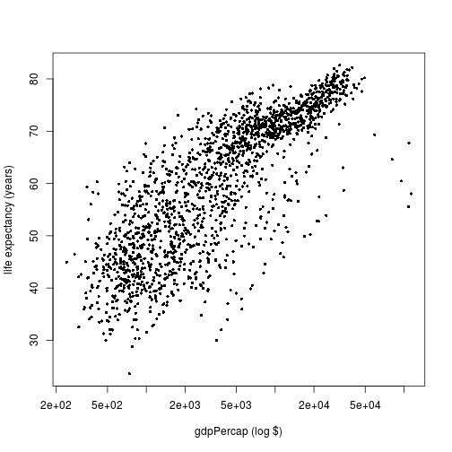

% R bootcamp, Module 5: Programming
% August 2018, UC Berkeley
% Chris Paciorek, with contributions from [Nima Hejazi](http://nimahejazi.org)


# Loops

In many languages, looping (for loops, while loops, etc.) is one of the main
constructs used to carry out computation. Loops are not emphasized as much in R,
both because they can be slow and because other syntax is often cleaner.

But there are lots of times when using a loop does make sense.

Most of you are probably familiar at least with the basic idea of iterating
through a series of steps. A for loop iterates through a pre-determined number
of iterations, while a while loop iterates until some condition is met. For
loops are more common in R, but while loops can be handy particularly for things
like optimization.

Let's take our use of `aggregate()` from Module 4 and use a for loop instead.


```r
DestSubset <- c('LAX','SEA','PHX','DEN','MSP','OAK','JFK','ATL','DFW','IAH',
                'ORD')
airSmall <- subset(air, Dest %in% DestSubset)
airSmall$late <- airSmall$DepDelay >= 15
airSmall$Month <- as.factor(airSmall$Month)
airSmall$Month <- relevel(airSmall$Month, "5")
airSmall$Dest <- as.character(airSmall$Dest)

out <- list()
length(out) <- length(DestSubset)
names(out) <- DestSubset

for (i in seq_along(DestSubset)) {
     # equivalently: for(i in 1:length(DestSubset))
     # n.b., seq_along(x) is better than 1:length(x), since it handles the case
     # where the length of an object is 0 or NULL more robustly.
     sub <- subset(airSmall, airSmall$Dest == DestSubset[i])
     if (sum(!is.na(sub$late)) && length(sub$late) > 1) {
     # fit logistic regression
       out[[i]] <- glm(late ~ Month, family = binomial, data = sub)
     } else {
       out[[i]] <- NA
     }
}
out[['OAK']]
```

```
## [1] NA
```

```r
summary(out[['IAH']])
```

```
## 
## Call:
## glm(formula = late ~ Month, family = binomial, data = sub)
## 
## Deviance Residuals: 
##     Min       1Q   Median       3Q      Max  
## -0.7365  -0.6121  -0.5750  -0.5252   2.2963  
## 
## Coefficients:
##              Estimate Std. Error z value Pr(>|z|)    
## (Intercept) -1.816777   0.096439 -18.839  < 2e-16 ***
## Month1       0.100730   0.136079   0.740   0.4592    
## Month2       0.204195   0.136910   1.491   0.1358    
## Month3       0.329094   0.129520   2.541   0.0111 *  
## Month4       0.153730   0.133867   1.148   0.2508    
## Month6       0.568904   0.124816   4.558 5.17e-06 ***
## Month7       0.237044   0.129051   1.837   0.0662 .  
## Month8       0.136570   0.131184   1.041   0.2978    
## Month9      -0.745516   0.166948  -4.466 7.99e-06 ***
## Month10      0.002425   0.136671   0.018   0.9858    
## Month11     -0.094463   0.140825  -0.671   0.5024    
## Month12      0.650724   0.124100   5.244 1.58e-07 ***
## ---
## Signif. codes:  0 '***' 0.001 '**' 0.01 '*' 0.05 '.' 0.1 ' ' 1
## 
## (Dispersion parameter for binomial family taken to be 1)
## 
##     Null deviance: 9334.1  on 10533  degrees of freedom
## Residual deviance: 9199.0  on 10522  degrees of freedom
##   (48 observations deleted due to missingness)
## AIC: 9223
## 
## Number of Fisher Scoring iterations: 5
```

```r
summary(out[['ORD']])
```

```
## 
## Call:
## glm(formula = late ~ Month, family = binomial, data = sub)
## 
## Deviance Residuals: 
##     Min       1Q   Median       3Q      Max  
## -0.8681  -0.7585  -0.7065  -0.6374   1.8404  
## 
## Coefficients:
##             Estimate Std. Error z value Pr(>|z|)    
## (Intercept) -1.36737    0.05601 -24.414  < 2e-16 ***
## Month1       0.34839    0.07732   4.506 6.61e-06 ***
## Month2       0.33658    0.07946   4.236 2.28e-05 ***
## Month3       0.26875    0.07777   3.456 0.000549 ***
## Month4       0.10664    0.07912   1.348 0.177701    
## Month6       0.48219    0.07538   6.397 1.59e-10 ***
## Month7       0.15244    0.07742   1.969 0.048939 *  
## Month8       0.12886    0.07773   1.658 0.097355 .  
## Month9      -0.11699    0.08168  -1.432 0.152086    
## Month10     -0.12304    0.08087  -1.521 0.128169    
## Month11      0.11599    0.07911   1.466 0.142599    
## Month12      0.58578    0.07505   7.805 5.95e-15 ***
## ---
## Signif. codes:  0 '***' 0.001 '**' 0.01 '*' 0.05 '.' 0.1 ' ' 1
## 
## (Dispersion parameter for binomial family taken to be 1)
## 
##     Null deviance: 24639  on 22500  degrees of freedom
## Residual deviance: 24453  on 22489  degrees of freedom
##   (483 observations deleted due to missingness)
## AIC: 24477
## 
## Number of Fisher Scoring iterations: 4
```

The iterations do not have to explicitly be over sequential numbers.


```r
for (dest in DestSubset) {
     cat(dest, '\n')
}
```

```
## LAX 
## SEA 
## PHX 
## DEN 
## MSP 
## OAK 
## JFK 
## ATL 
## DFW 
## IAH 
## ORD
```

# While loop

It's not a particularly interesting example, but we can see the `while` loop
syntax in the same example.


```r
out <- list(); length(out) <- length(DestSubset); names(out) <- DestSubset

i <- 1
while (i <= length(DestSubset)) {
     sub <- subset(airSmall, airSmall$Dest == DestSubset[i])
     if (sum(!is.na(sub$late)) && length(sub$late) > 1) {
     # fit logistic regression
       out[[i]] <- glm(late ~ Month, family = binomial, data = sub)
     } else {
       out[[i]] <- NA
     }
     i = i + 1
}
summary(out[['IAH']])
```

```
## 
## Call:
## glm(formula = late ~ Month, family = binomial, data = sub)
## 
## Deviance Residuals: 
##     Min       1Q   Median       3Q      Max  
## -0.7365  -0.6121  -0.5750  -0.5252   2.2963  
## 
## Coefficients:
##              Estimate Std. Error z value Pr(>|z|)    
## (Intercept) -1.816777   0.096439 -18.839  < 2e-16 ***
## Month1       0.100730   0.136079   0.740   0.4592    
## Month2       0.204195   0.136910   1.491   0.1358    
## Month3       0.329094   0.129520   2.541   0.0111 *  
## Month4       0.153730   0.133867   1.148   0.2508    
## Month6       0.568904   0.124816   4.558 5.17e-06 ***
## Month7       0.237044   0.129051   1.837   0.0662 .  
## Month8       0.136570   0.131184   1.041   0.2978    
## Month9      -0.745516   0.166948  -4.466 7.99e-06 ***
## Month10      0.002425   0.136671   0.018   0.9858    
## Month11     -0.094463   0.140825  -0.671   0.5024    
## Month12      0.650724   0.124100   5.244 1.58e-07 ***
## ---
## Signif. codes:  0 '***' 0.001 '**' 0.01 '*' 0.05 '.' 0.1 ' ' 1
## 
## (Dispersion parameter for binomial family taken to be 1)
## 
##     Null deviance: 9334.1  on 10533  degrees of freedom
## Residual deviance: 9199.0  on 10522  degrees of freedom
##   (48 observations deleted due to missingness)
## AIC: 9223
## 
## Number of Fisher Scoring iterations: 5
```

# Branching (if-then-else syntax)

We already saw an example of branching in the *for* loop example.

Here's a simple example to illustrate the syntax. Note that the *then* is
implicit.


```r
val <- rnorm(1)
val
```

```
## [1] 2.099657
```

```r
if (val < 0) {
  print("val is negative")
} else {
  print("val is positive")
}
```

```
## [1] "val is positive"
```

We can chain together `if` statements as follows.


```r
val <- rnorm(1)
val
```

```
## [1] 0.6584765
```

```r
if (val < -1) {
  print("val is more than one standard deviation below the mean.")
} else if (abs(val) <= 1) {
  print("val is within one standard deviation of the mean.")
} else {
  print("val is more than one standard deviation above the mean.")
}
```

```
## [1] "val is within one standard deviation of the mean."
```

In general, the `{` brackets are only needed if you have multiple R expressions,
but R will complain when an `else` starts a line of code, so generally using the
`{` is good practice. That said, this _works just fine_:


```r
if (val < 0) print("val is negative") else print("val is positive")
```

```
## [1] "val is positive"
```

# The condition in an if statement

The condition in the if statement cannot be NA or R will give an error. This is
a very common bug.

Suppose we were (inefficiently) setting up a new field using an if statement.

```r
air$late <- rep(0, nrow(air))
for (i in 1:20) {
      if(air$DepDelay[i] > 15)
          air$late[i] <- 1 else air$late[i] <- 0
}
```

```
## Error in if (air$DepDelay[i] > 15) air$late[i] <- 1 else air$late[i] <- 0: missing value where TRUE/FALSE needed
```

```r
print(i)
```

```
## [1] 4
```

```r
if(air$DepDelay[4] > 15) print('here')
```

```
## Error in if (air$DepDelay[4] > 15) print("here"): missing value where TRUE/FALSE needed
```

```r
air$DepDelay[4] > 15
```

```
## [1] NA
```

```r
air$DepDelay[4]
```

```
## [1] NA
```

An `NA`/`NaN` is the main reason an if statement may fail, because R will
generally convert other values to logical values.

Zero evaluates to `FALSE`, all other numbers evaluate to `TRUE`. In general
strings are not converted to booleans.

A more robust alternative is to use `isTRUE()`:


```r
air$late <- rep(0, nrow(air))
for (i in 1:20) {
      if(isTRUE(air$DepDelay[i] > 15))
          air$late[i] <- 1 else air$late[i] <- 0
}


# Flow control: `next` and `break` statements

`next` skips the current evaluation of the loop statements:
```

```
## Error: <text>:10:8: unexpected symbol
## 9: 
## 10: `next` skips
##            ^
```

```r
out <- list(); length(out) <- length(DestSubset); names(out) <- DestSubset

for (i in seq_along(DestSubset)) {
     # equivalently: for(i in 1:length(DestSubset))
     sub <- subset(airSmall, airSmall$Dest == DestSubset[i])
     if(sum(!is.na(sub$late)) && length(sub$late) > 1) {
     # fit logistic regression
       out[[i]] <- glm(late ~ Month, family = binomial, data = sub)
     } else {
       next
     }
}
cat("We got to iteration ", i, " of ", length(DestSubset), " items.", sep = "")
```

```
## We got to iteration 11 of 11 items.
```

```r
out[['OAK']]
```

```
## NULL
```

`break` immediately ends loop evaluation:

```r
out <- list(); length(out) <- length(DestSubset); names(out) <- DestSubset

for (i in seq_along(DestSubset)) {
     # equivalently: for(i in 1:length(DestSubset))
     sub <- subset(airSmall, airSmall$Dest == DestSubset[i])
     if(sum(!is.na(sub$late)) && length(sub$late) > 1) {
     # fit logistic regression
       out[[i]] <- glm(late ~ Month, family = binomial, data = sub)
     } else {
       break
     }
}
cat("We got to iteration ", i, " of ", length(DestSubset), " items.", sep = "")
```

```
## We got to iteration 6 of 11 items.
```

Effective use of `next` and `break` can make your `for` (and other) loops both
more robust and efficient (e.g., by skipping cases where computations may fail).

# Functions

Functions are one of the most important constructs in R (and many other
languages). They allow you to modularize your code - encapsulating a set of
repeatable operations as an individual function call.

You should rely heavily on functions rather than having long sets of
expressions in R scripts.

Functions have many important advantages:

- They reduce bugs by avoiding having multiple instances of the same
  functionality.
- They reduce time involved in coding by eliminating redundancy.
- They make for cleaner and more easily-readable code.

A basic goal is writing functions is *modularity*.

In general, a function should

- be fairly short,
- be focused and specific in what it does, and
- be designed so that it can be used in combination with other functions to
  carry out more complicated operations.

# Writing functions

In module 4, we sorted the airline `data.frame`.


```r
ord <- order(air$DepDelay, air$ArrDelay, decreasing = TRUE)
ord[1:5]
```

```
## [1] 115794 396990 337213 168750 415550
```

```r
air_ordered <- air[ord, ]
```

How would we encapsulate that functionality generically so that
we can apply it to other `data.frame`s (or matrices)?


```r
colSort <- function(data, col1, col2) {
    # Sorts a matrix or dataframe based on two  columns
    #
    # Args:
    #     data: a dataframe or matrix with at least columns
    #                  and any number of rows
    #     col1: a reference to the column to sort on
    #     col2: a reference to the column to use for ties
    #
    # Returns:
    #     <data> sorted in increasing order by the values
    #     in the first column. Any ties should be broken by values
    #     in the second column. The row pairs should be maintained
    #     in this result

    ord <- order(data[, col1], data[, col2], decreasing=TRUE)
    sorted <- data[ord, ]
    return(sorted)
}

identical(air_ordered, colSort(air, "DepDelay", "ArrDelay"))
```

```
## [1] TRUE
```

Of course this is somewhat limited in that it is specific to sorting based on
two columns. We'd usually want to extend this to be more general, but it's
usually good to start with something concrete and more limited in generality and
then generalize once you are sure it works.

# Function arguments

R can match arguments by name (when provided) or by position (the fall-back). It
also allows one to specify default values so that the user doesn't have to
explicitly provide all the arguments.


```r
colSort <- function(data, col1 = 1, col2 = 2) {
    ord <- order(data[, col1], data[, col2], decreasing=TRUE)
    sorted <- data[ord, ]
    return(sorted)
}
identical(colSort(air, 1, 2), colSort(air))
```

```
## [1] TRUE
```

```r
identical(colSort(col2 = 2, data = air, col1 = 1), colSort(air, 1, 2))
```

```
## [1] TRUE
```

# What is the "..." argument for?

Using `...` as one of the arguments to a function allows a function to pass
along user-provided arguments without specifying explicitly what the user might
provide.

Here's an example of tailoring some plotting specifications that I use a lot. I
generally define `pplot()` in my *.Rprofile* file so it is always available to
me.


```r
pplot <- function(x, y, ...) {
      plot(x, y, pch = 16, cex = 0.6, ...)
}

sub <- air[sample(1:nrow(air), 10000, replace = FALSE), ]
sub$DepDelay[sub$DepDelay > 120] <- 120
sub$DepDelay[sub$DepDelay < -30] <- -30
pplot(sub$Distance, sub$DepDelay, xlab = 'distance (miles)',
      ylab = 'delay (minutes)', log = 'x')
```




# Important concepts with R functions

Functions in R return an object. In general, R functions are and should be
designed such that the only effect of the function is through the return value.

**Side effects** are when a function affects the state of the world in
addition to its return value.  Can you think of any side effects that
you saw an R function produce from earlier today?  What about:

- `library()`
- `setwd()`
- `plot()`

Functions in R are (roughly) *pass-by-value* and not *pass-by-reference*. This
means that if you modify an argument inside the function it will not change the
original value outside the function. This protects you from a major potential
source of side effects. (There are exceptions to this rule.)

In actuality, functions in R are *call-by-value*. What this means for our
purposes is that you can pass an input argument in without a copy being made of
it. This saves time and memory. At the time that you modify the input within the
function (if ever), then a copy is made and  the modified input is different
than the original value outside the function.

# Variable scope and global variables

In general functions should not make use of variables from outside the function.
(However, for quick-and-dirty work and in some other circumstances, one may do
this.) This provides modularity and reduces bugs and surprises.

If R can't find a variable that is used in a function based on the function
arguments and variables defined locally in the function, it goes and looks
elsewhere following a set of rules called *lexical scoping*. (This type of
scoping has to do with R's roots (and explains why R is very similar to other
languages for functional programming) - we won't go into details here but
certainly worth looking into as you start using R more.)

Basically this means that it looks for variables relative to where the function
is defined (not relative to where the function is called).

This can get involved, but a couple brief examples illustrate the basic idea.


```r
x <- 2
f <- function(y) {
    return(x + y)
}
f(1)
```

```
## [1] 3
```

```r
g <- function(y) {
  x <- 10
  return(f(y))
}

g(1)
```

```
## [1] 3
```

```r
g <- function(y) {
  f <- function(y) {
     return(x + y)
  }
  x <- 10
  return(f(y))
}

g(1)
```

```
## [1] 11
```

Note that `x` is used as a global variable here, which in general is bad
practice.

# When do I start programming?

> “[W]e wanted users to be able to begin in an interactive environment,
> where they did not consciously think of themselves as programming.
> Then as their needs became clearer and their sophistication increased,
> they should be able **to slide gradually into programming, when the
> language and system aspects would become more important**.”

[John Chambers, “Stages in the Evolution of
S”](http://www.stat.bell-labs.com/S/history.html)

# Key Principles of R

- Everything that exists is an object.
- Everything that happens is a function call.

   [John Chambers' useR!2014
   talk](http://user2014.stat.ucla.edu/files/chambers.pdf)

### What does the 2nd principle mean?

Are arithmetic operations really just functions?

```r
3+2
```

```
## [1] 5
```

```r
'+'(3,2)
```

```
## [1] 5
```

Yes!

And what about indexing?


```r
x <- matrix(runif(100), 10)
x[ , 2]
```

```
##  [1] 0.95388021 0.70479070 0.45431020 0.73198802 0.37230402 0.75122663
##  [7] 0.03154032 0.05696075 0.29466231 0.15265909
```

```r
'['(x , , 2)
```

```
##  [1] 0.95388021 0.70479070 0.45431020 0.73198802 0.37230402 0.75122663
##  [7] 0.03154032 0.05696075 0.29466231 0.15265909
```

Also yes!

This holds more generally - one can investigate and see the same thing in terms
of a `for` loop.

### What does the 1st principle mean?


```r
class(1)
```

```
## [1] "numeric"
```

```r
class(runif)
```

```
## [1] "function"
```

```r
class(function(x) x^2)
```

```
## [1] "function"
```

```r
square <- function(x) x^2
class(square)
```

```
## [1] "function"
```

# Modern Functional Programming in R (Advanced)

Now that we've taken an extensive look at `for` loops and programming with
functions, we can move on from base R to look at more modern and powerful tools
for programming provided by [`purrr`](http://purrr.tidyverse.org/), a core
package in the [`tidyverse`](http://www.tidyverse.org/), a set of modern tools
for "doing data science" in R. `purrr` provides facilities to manipulate data
sets using functions in a "tidy" manner. Using `purrr` requires familiarity with
several other core packages of the `tidyverse`, most notably `dplyr` and
`magrittr`. We won't have time to cover details of how to use `purrr` here, but
we highly recommend you look into these packages as you continuing exploring R.


```r
library(dplyr)
library(purrr)
```

We'll leave you with a simple example of how to use `purrr` to deal with a task
we already looked at with `for` loops. In fact, we'll return to the logistic
regression exercise that we started with.

### A simple example

Let's take a look at our `airSmall` data set again. Recall that our goal was to
fit a logistic regression model, with the outcome being late arrival (binary)
and the only explanatory variable being the month. To fit our models across each
of the destination separately, we'll first need to put our data in "tidy"
format. It's _really easy_ with some helpful verbs from `dplyr`...


```r
# let's clean up the data set first
airSmall_tidy <- airSmall %>%
  split(.$Dest)
```

Now, we can fit our logistic regression models across each of the destinations
using `purrr`'s `map`:


```r
airSmall_glms <- airSmall_tidy %>%
  map(~glm(late ~ Month, family = binomial, data = .))
```

```
## Error in `contrasts<-`(`*tmp*`, value = contr.funs[1 + isOF[nn]]): contrasts can be applied only to factors with 2 or more levels
```


Uh oh, what happened here?

Oh, that's right...we had to protect against situations where there wasn't
enough variation in the outcome variable (all flights late or on time, or with
too much missing-ness). We did this with an `if` statement.

So, can `purrr` handle this? *Yes* - in fact, it's really easy. We can use a
verb called `safely` to separate situations where the GLM succeeds from those
where it doesn't. Let's try it out


```r
airSmall_glms <- airSmall_tidy %>%
  map(safely(~glm(late ~ Month, family = binomial, data = .)))
```

_Remark:_ What we accomplish here with `purrr::map` is also easily done using
tools from base R. In fact, using `lapply`, we can evaluate the very same `glm`
formula with our `airSmall` dataset, albeit without the extra goodies offered by
the pipe (aka `%>%`) syntax and the `safely` convenience, afforded by `magrittr`
and `purrr`, respectively.

Ok. Now, we'll look at the results for one destination, just to get a feel for
the output


```r
airSmall_glms$LAX$result
```

```
## 
## Call:  glm(formula = late ~ Month, family = binomial, data = .)
## 
## Coefficients:
## (Intercept)       Month1       Month2       Month3       Month4  
##    -1.53016      0.28260      0.26799      0.04350     -0.11293  
##      Month6       Month7       Month8       Month9      Month10  
##     0.36191      0.21491      0.08889     -0.09919      0.02030  
##     Month11      Month12  
##     0.05893      0.63107  
## 
## Degrees of Freedom: 43034 Total (i.e. Null);  43023 Residual
##   (1230 observations deleted due to missingness)
## Null Deviance:	    43390 
## Residual Deviance: 43080 	AIC: 43100
```

As a sanity check, we'll make sure our results match those from before. (We do
this for one destination city for convenience. When working, it never hurts to
be too safe - best to check them all.)


```r
all.equal(coef(airSmall_glms$LAX$result), coef(out$LAX))
```

```
## [1] TRUE
```

Looks like everything worked out just fine!

Now that we've seen what we can do with `purrr`, it's important to compare this
modern approach to what is offered in base R. (It's very important to understand
and be comfortable with using tools from base R before adopting those that are
offered as part of the `tidyverse`.) To that end, here are some points of
comparison:

* Is `purrr::map` really different from `lapply`, `sapply`, `vapply`?
  * `purrr` is:
    * Consistent in the type of object returned
    * contains many useful shortcuts and convenience functions (e.g., `safely`)
    * Syntax accommodates more complicated iteration schemes.
  * [l/s/v]`apply`:
    * The type of object returned is _not_ always consistent
    * Has fewer dependencies (implented in base R rather than `tidyverse`)
     * Syntax can be unwieldy for more complex use-cases.

For a full comparison of `purrr` versus base R, consider checking out [this
quite thorough
tutorial](https://jennybc.github.io/purrr-tutorial/bk01_base-functions.html) by
Jenny Bryan.

### Onwards: Readings and References

* A great reference for learning both basic and advanced concepts in using the R
  language for data analysis is the book _R for Data Science_, by Garrett
  Grolemund and Hadley Wickham. An online version is freely available and may be
  accessed [here](http://r4ds.had.co.nz/). In particular, [chapter 21
  ("Iteration")](http://r4ds.had.co.nz/iteration.html) is a great review of much
  of what we have covered in this module.

* [Here](http://purrr.tidyverse.org/) you can explore the documentation website
  for the `purrr` package. It includes details about functionality we did not
  have time to discuss and many useful examples that you can use to go further
  with `purrr`.

* [Here](http://www.tidyverse.org/) you can browse the `tidyverse` documentation
  website. It includes an introduction to the core packages, the philosophy of
  this ecosystem of packages, and much more.

# Breakout

### Basics

1) Write an R function that will take an input vector and set any negative
values in the vector to zero.

### Using the ideas

2) Write an R function that will take an input vector and set any value below a
threshold to be the value of threshold. Optionally, the function should instead
set values above a threshold to the value of the threshold.

3) Augment your function so that it checks that the input is a numeric vector
and return an error if not. (See the help information for `stop()`.)

4) Figure out what `invisible()` does and why it is useful when writing
functions. Use `invisible()` in your function from just above or in the
`colSort()` function.

### Advanced

5) Extend the `colSort()` function to handle an arbitrary number of columns on
which to do the sorting. You may need to modify the functionality a bit to use
full vectors for the sorting rather than column names.

6) Extend the `colSort()` function so that it can take either numeric indices or
character strings indicating columns of the input data or take entire vectors to
use in the sorting of the input data. If information specifying columns is
given, make sure your function carefully checks that the input refers to
legitimate columns and returns an error or warning (see `warning()`) if not.

7) Explore scoping in the following code. Explain why the result is 11 and not 3. Note that `funGenerator()` returns a function as the return object,
consistent with the idea that functions are objects in R. This is an example of
what is called a *closure* in R. Basically, the function contains object(s)
enclosed with and accessible to the function.

```r
funGenerator <- function(x) {
   x <- 10
   g <- function(y) {
      return(x + y)
   }
   return(g)
}

x <- 2
f <- funGenerator()
f(1)
```

```
## [1] 11
```
