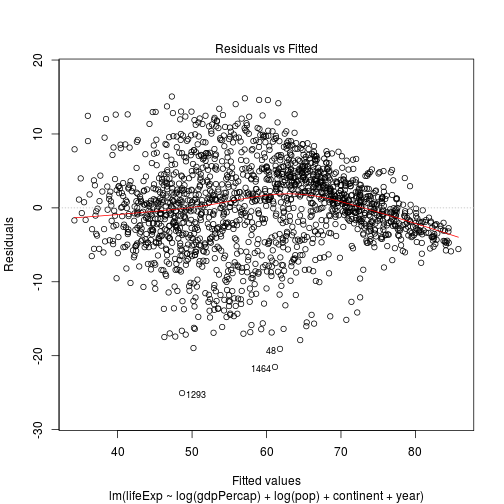
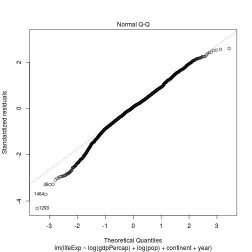
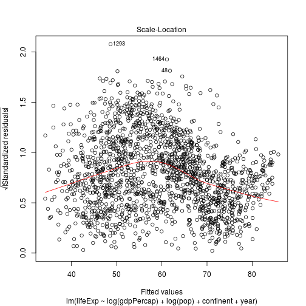
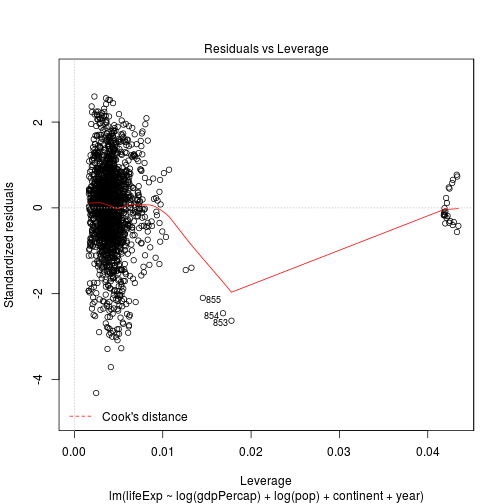

% R bootcamp, Module 7: Analysis
% January 2019, UC Berkeley
% Chris Paciorek


# Describing relationships

- Once we've carried out group-wise operations and perhaps reshaped it, we may also like to describe the relationships in the data. Often this involves fitting some style of regression model.  The goal can be pure prediction, description, or inferring a causal relationship between variables.

Of course to infer causality, one has to be quite careful and techniques that try to avoid the usual pitfall that correlation is not causation are way beyond what we can cover here.

We'll just see the basics of how to fit regressions here. 

# Inference/Regression

- Running regressions in R is generally straightforward.

- Most basic, catch-all regression function in R is *glm*

- *glm* fits a generalized linear model with your choice of family/link function (gaussian, logit, poisson, etc.)

- *lm* is just a standard linear regression (equivalent to glm with family = gaussian(link = "identity"))

- The basic glm call looks something like this:


```r
glm(formula = y ~ x1 + x2 + x3 + ..., family = familyname(link = "linkname"),
            data = )
```

- There are a bunch of families and links to use (help(family) for a full list), but some essentials are **binomial(link = "logit")**, **gaussian(link = "identity")**, and **poisson(link = "log")**

If you're using `lm`, the call looks the same but without the `family` argument. 

- Example: suppose we want to regress the life expectency on the GDP per capita and the population, as well as the continent and year.  The lm/glm call would be something like this:


```r
reg <- lm(formula = lifeExp ~ log(gdpPercap) + log(pop) + continent + year, 
                data = gap)
```

# Regression output

- When we store this regression in an object, we get access to several items of interest


```r
# View components contained in the regression output
names(reg)
```

```
##  [1] "coefficients"  "residuals"     "effects"       "rank"         
##  [5] "fitted.values" "assign"        "qr"            "df.residual"  
##  [9] "contrasts"     "xlevels"       "call"          "terms"        
## [13] "model"
```

```r
# Examine regression coefficients
reg$coefficients
```

```
##       (Intercept)    log(gdpPercap)          log(pop) continentAmericas 
##      -460.8132741         5.0756110         0.1530312         8.7453560 
##     continentAsia   continentEurope  continentOceania              year 
##         6.8254916        12.2808442        12.5398669         0.2377202
```

```r
# Examine regression degrees of freedom
reg$df.residual
```

```
## [1] 1696
```

```r
# See the standard (diagnostic) plots for a regression
plot(reg)
```



- R has a helpful summary method for regression objects

```r
summary(reg)
```

```
## 
## Call:
## lm(formula = lifeExp ~ log(gdpPercap) + log(pop) + continent + 
##     year, data = gap)
## 
## Residuals:
##      Min       1Q   Median       3Q      Max 
## -25.0572  -3.2857   0.3289   3.7062  15.0650 
## 
## Coefficients:
##                     Estimate Std. Error t value Pr(>|t|)    
## (Intercept)       -4.608e+02  1.697e+01 -27.154   <2e-16 ***
## log(gdpPercap)     5.076e+00  1.627e-01  31.191   <2e-16 ***
## log(pop)           1.530e-01  9.668e-02   1.583    0.114    
## continentAmericas  8.745e+00  4.766e-01  18.349   <2e-16 ***
## continentAsia      6.825e+00  4.232e-01  16.128   <2e-16 ***
## continentEurope    1.228e+01  5.292e-01  23.205   <2e-16 ***
## continentOceania   1.254e+01  1.281e+00   9.788   <2e-16 ***
## year               2.377e-01  8.932e-03  26.614   <2e-16 ***
## ---
## Signif. codes:  0 '***' 0.001 '**' 0.01 '*' 0.05 '.' 0.1 ' ' 1
## 
## Residual standard error: 5.811 on 1696 degrees of freedom
## Multiple R-squared:  0.7985,	Adjusted R-squared:  0.7976 
## F-statistic:   960 on 7 and 1696 DF,  p-value: < 2.2e-16
```

- Can also extract useful things from the summary object


```r
# Store summary method results
summ_reg <- summary(reg)
# View summary method results objects
objects(summ_reg)
```

```
##  [1] "adj.r.squared" "aliased"       "call"          "coefficients" 
##  [5] "cov.unscaled"  "df"            "fstatistic"    "residuals"    
##  [9] "r.squared"     "sigma"         "terms"
```

```r
# View table of coefficients
summ_reg$coefficients
```

```
##                       Estimate   Std. Error    t value      Pr(>|t|)
## (Intercept)       -460.8132741 16.970277820 -27.154138 3.961833e-135
## log(gdpPercap)       5.0756110  0.162724177  31.191499 3.371693e-169
## log(pop)             0.1530312  0.096677948   1.582897  1.136315e-01
## continentAmericas    8.7453560  0.476599244  18.349496  9.605994e-69
## continentAsia        6.8254916  0.423203644  16.128149  1.492420e-54
## continentEurope     12.2808442  0.529239698  23.204692 1.123344e-103
## continentOceania    12.5398669  1.281141831   9.788040  4.798636e-22
## year                 0.2377202  0.008932106  26.614126 1.058968e-130
```

- Note that, in our results, R has broken up our variables into their different factor levels (as it will do whenever your regressors have factor levels)

- If your data aren't factorized, you can tell lm/glm to factorize a variable (i.e. create dummy variables on the fly) by writing


```r
glm(formula = y ~ x1 + x2 + factor(x3), family = family(link = "link"),
            data = )
```

# Setting up regression interactions

- There are also some useful shortcuts for regressing on interaction terms:

`x1:x2` interacts all terms in x1 with all terms in x2

```r
summary(lm(lifeExp ~ log(gdpPercap) + log(pop) +
                    continent:factor(year), 
                    data = gap))
```

```
## 
## Call:
## lm(formula = lifeExp ~ log(gdpPercap) + log(pop) + continent:factor(year), 
##     data = gap)
## 
## Residuals:
##      Min       1Q   Median       3Q      Max 
## -26.5678  -2.5530   0.0044   2.9146  15.5667 
## 
## Coefficients: (1 not defined because of singularities)
##                                     Estimate Std. Error t value Pr(>|t|)
## (Intercept)                         27.18384    4.68490   5.802 7.83e-09
## log(gdpPercap)                       5.07950    0.16049  31.650  < 2e-16
## log(pop)                             0.07894    0.09427   0.837 0.402510
## continentAfrica:factor(year)1952   -24.14252    4.11250  -5.871 5.25e-09
## continentAmericas:factor(year)1952 -16.44650    4.16627  -3.948 8.23e-05
## continentAsia:factor(year)1952     -19.33470    4.14083  -4.669 3.27e-06
## continentEurope:factor(year)1952    -7.09176    4.13518  -1.715 0.086537
## continentOceania:factor(year)1952   -6.06350    5.65111  -1.073 0.283440
## continentAfrica:factor(year)1957   -22.49637    4.10985  -5.474 5.09e-08
## continentAmericas:factor(year)1957 -14.36734    4.16433  -3.450 0.000575
## continentAsia:factor(year)1957     -17.17434    4.13753  -4.151 3.48e-05
## continentEurope:factor(year)1957    -5.90941    4.13272  -1.430 0.152934
## continentOceania:factor(year)1957   -5.62997    5.65034  -0.996 0.319206
## continentAfrica:factor(year)1962   -21.01387    4.10690  -5.117 3.47e-07
## continentAmericas:factor(year)1962 -12.31354    4.16305  -2.958 0.003143
## continentAsia:factor(year)1962     -15.56258    4.13513  -3.764 0.000173
## continentEurope:factor(year)1962    -5.05421    4.13082  -1.224 0.221302
## continentOceania:factor(year)1962   -5.31223    5.64979  -0.940 0.347226
## continentAfrica:factor(year)1967   -19.70336    4.10348  -4.802 1.72e-06
## continentAmericas:factor(year)1967 -10.93238    4.16129  -2.627 0.008690
## continentAsia:factor(year)1967     -13.15690    4.13270  -3.184 0.001482
## continentEurope:factor(year)1967    -4.91343    4.12905  -1.190 0.234232
## continentOceania:factor(year)1967   -5.77117    5.64916  -1.022 0.307122
## continentAfrica:factor(year)1972   -18.14692    4.10075  -4.425 1.03e-05
## continentAmericas:factor(year)1972  -9.65366    4.15954  -2.321 0.020417
## continentAsia:factor(year)1972     -11.60139    4.12929  -2.810 0.005020
## continentEurope:factor(year)1972    -4.97628    4.12753  -1.206 0.228133
## continentOceania:factor(year)1972   -5.80936    5.64868  -1.028 0.303891
## continentAfrica:factor(year)1977   -16.18475    4.09960  -3.948 8.22e-05
## continentAmericas:factor(year)1977  -8.33819    4.15801  -2.005 0.045092
## continentAsia:factor(year)1977     -10.12201    4.12699  -2.453 0.014285
## continentEurope:factor(year)1977    -4.55230    4.12667  -1.103 0.270128
## continentOceania:factor(year)1977   -5.12322    5.64848  -0.907 0.364535
## continentAfrica:factor(year)1982   -14.19333    4.09899  -3.463 0.000549
## continentAmericas:factor(year)1982  -6.59214    4.15772  -1.586 0.113041
## continentAsia:factor(year)1982      -7.60009    4.12571  -1.842 0.065636
## continentEurope:factor(year)1982    -4.11846    4.12623  -0.998 0.318370
## continentOceania:factor(year)1982   -4.05526    5.64827  -0.718 0.472882
## continentAfrica:factor(year)1987   -12.18504    4.09947  -2.972 0.002998
## continentAmericas:factor(year)1987  -4.71568    4.15765  -1.134 0.256870
## continentAsia:factor(year)1987      -5.69142    4.12491  -1.380 0.167846
## continentEurope:factor(year)1987    -3.72976    4.12583  -0.904 0.366126
## continentOceania:factor(year)1987   -3.51642    5.64805  -0.623 0.533640
## continentAfrica:factor(year)1992   -11.80275    4.09942  -2.879 0.004039
## continentAmericas:factor(year)1992  -3.28548    4.15749  -0.790 0.429492
## continentAsia:factor(year)1992      -4.38228    4.12405  -1.063 0.288113
## continentEurope:factor(year)1992    -2.51508    4.12618  -0.610 0.542249
## continentOceania:factor(year)1992   -1.98041    5.64799  -0.351 0.725904
## continentAfrica:factor(year)1997   -11.95773    4.09861  -2.918 0.003576
## continentAmericas:factor(year)1997  -2.16110    4.15661  -0.520 0.603190
## continentAsia:factor(year)1997      -3.50157    4.12279  -0.849 0.395826
## continentEurope:factor(year)1997    -2.08430    4.12564  -0.505 0.613482
## continentOceania:factor(year)1997   -1.44783    5.64778  -0.256 0.797710
## continentAfrica:factor(year)2002   -12.52375    4.09722  -3.057 0.002274
## continentAmericas:factor(year)2002  -0.98980    4.15641  -0.238 0.811804
## continentAsia:factor(year)2002      -2.67982    4.12205  -0.650 0.515707
## continentEurope:factor(year)2002    -1.57345    4.12518  -0.381 0.702937
## continentOceania:factor(year)2002   -0.47345    5.64768  -0.084 0.933201
## continentAfrica:factor(year)2007   -11.65685    4.09478  -2.847 0.004472
## continentAmericas:factor(year)2007  -0.69311    4.15497  -0.167 0.867536
## continentAsia:factor(year)2007      -2.20076    4.12023  -0.534 0.593320
## continentEurope:factor(year)2007    -1.52841    4.12475  -0.371 0.711024
## continentOceania:factor(year)2007         NA         NA      NA       NA
##                                       
## (Intercept)                        ***
## log(gdpPercap)                     ***
## log(pop)                              
## continentAfrica:factor(year)1952   ***
## continentAmericas:factor(year)1952 ***
## continentAsia:factor(year)1952     ***
## continentEurope:factor(year)1952   .  
## continentOceania:factor(year)1952     
## continentAfrica:factor(year)1957   ***
## continentAmericas:factor(year)1957 ***
## continentAsia:factor(year)1957     ***
## continentEurope:factor(year)1957      
## continentOceania:factor(year)1957     
## continentAfrica:factor(year)1962   ***
## continentAmericas:factor(year)1962 ** 
## continentAsia:factor(year)1962     ***
## continentEurope:factor(year)1962      
## continentOceania:factor(year)1962     
## continentAfrica:factor(year)1967   ***
## continentAmericas:factor(year)1967 ** 
## continentAsia:factor(year)1967     ** 
## continentEurope:factor(year)1967      
## continentOceania:factor(year)1967     
## continentAfrica:factor(year)1972   ***
## continentAmericas:factor(year)1972 *  
## continentAsia:factor(year)1972     ** 
## continentEurope:factor(year)1972      
## continentOceania:factor(year)1972     
## continentAfrica:factor(year)1977   ***
## continentAmericas:factor(year)1977 *  
## continentAsia:factor(year)1977     *  
## continentEurope:factor(year)1977      
## continentOceania:factor(year)1977     
## continentAfrica:factor(year)1982   ***
## continentAmericas:factor(year)1982    
## continentAsia:factor(year)1982     .  
## continentEurope:factor(year)1982      
## continentOceania:factor(year)1982     
## continentAfrica:factor(year)1987   ** 
## continentAmericas:factor(year)1987    
## continentAsia:factor(year)1987        
## continentEurope:factor(year)1987      
## continentOceania:factor(year)1987     
## continentAfrica:factor(year)1992   ** 
## continentAmericas:factor(year)1992    
## continentAsia:factor(year)1992        
## continentEurope:factor(year)1992      
## continentOceania:factor(year)1992     
## continentAfrica:factor(year)1997   ** 
## continentAmericas:factor(year)1997    
## continentAsia:factor(year)1997        
## continentEurope:factor(year)1997      
## continentOceania:factor(year)1997     
## continentAfrica:factor(year)2002   ** 
## continentAmericas:factor(year)2002    
## continentAsia:factor(year)2002        
## continentEurope:factor(year)2002      
## continentOceania:factor(year)2002     
## continentAfrica:factor(year)2007   ** 
## continentAmericas:factor(year)2007    
## continentAsia:factor(year)2007        
## continentEurope:factor(year)2007      
## continentOceania:factor(year)2007     
## ---
## Signif. codes:  0 '***' 0.001 '**' 0.01 '*' 0.05 '.' 0.1 ' ' 1
## 
## Residual standard error: 5.648 on 1642 degrees of freedom
## Multiple R-squared:  0.8157,	Adjusted R-squared:  0.8088 
## F-statistic: 119.1 on 61 and 1642 DF,  p-value: < 2.2e-16
```

`x1*x2` produces the cross of x1 and x2, or x1+x2+x1:x2

```r
summary(lm(lifeExp ~ log(gdpPercap) + log(pop) + continent*factor(year), 
                data = gap))
```

```
## 
## Call:
## lm(formula = lifeExp ~ log(gdpPercap) + log(pop) + continent * 
##     factor(year), data = gap)
## 
## Residuals:
##      Min       1Q   Median       3Q      Max 
## -26.5678  -2.5530   0.0044   2.9146  15.5667 
## 
## Coefficients:
##                                    Estimate Std. Error t value Pr(>|t|)
## (Intercept)                         3.04133    2.07409   1.466 0.142746
## log(gdpPercap)                      5.07950    0.16049  31.650  < 2e-16
## log(pop)                            0.07894    0.09427   0.837 0.402510
## continentAmericas                   7.69602    1.39324   5.524 3.85e-08
## continentAsia                       4.80781    1.26567   3.799 0.000151
## continentEurope                    17.05075    1.32948  12.825  < 2e-16
## continentOceania                   18.07902    4.08899   4.421 1.05e-05
## factor(year)1957                    1.64615    1.10777   1.486 0.137470
## factor(year)1962                    3.12865    1.10838   2.823 0.004819
## factor(year)1967                    4.43915    1.10969   4.000 6.61e-05
## factor(year)1972                    5.99560    1.11134   5.395 7.85e-08
## factor(year)1977                    7.95776    1.11240   7.154 1.27e-12
## factor(year)1982                    9.94918    1.11336   8.936  < 2e-16
## factor(year)1987                   11.95748    1.11375  10.736  < 2e-16
## factor(year)1992                   12.33976    1.11463  11.071  < 2e-16
## factor(year)1997                   12.18479    1.11605  10.918  < 2e-16
## factor(year)2002                   11.61877    1.11805  10.392  < 2e-16
## factor(year)2007                   12.48567    1.12120  11.136  < 2e-16
## continentAmericas:factor(year)1957  0.43301    1.94383   0.223 0.823748
## continentAsia:factor(year)1957      0.51422    1.77764   0.289 0.772410
## continentEurope:factor(year)1957   -0.46380    1.83127  -0.253 0.800095
## continentOceania:factor(year)1957  -1.21261    5.75524  -0.211 0.833150
## continentAmericas:factor(year)1962  1.00431    1.94383   0.517 0.605458
## continentAsia:factor(year)1962      0.64348    1.77767   0.362 0.717414
## continentEurope:factor(year)1962   -1.09110    1.83146  -0.596 0.551422
## continentOceania:factor(year)1962  -2.37738    5.75524  -0.413 0.679601
## continentAmericas:factor(year)1967  1.07497    1.94383   0.553 0.580329
## continentAsia:factor(year)1967      1.73865    1.77767   0.978 0.328194
## continentEurope:factor(year)1967   -2.26082    1.83170  -1.234 0.217278
## continentOceania:factor(year)1967  -4.14682    5.75524  -0.721 0.471302
## continentAmericas:factor(year)1972  0.79724    1.94383   0.410 0.681756
## continentAsia:factor(year)1972      1.73772    1.77790   0.977 0.328513
## continentEurope:factor(year)1972   -3.88011    1.83221  -2.118 0.034348
## continentOceania:factor(year)1972  -5.74146    5.75524  -0.998 0.318618
## continentAmericas:factor(year)1977  0.15055    1.94389   0.077 0.938277
## continentAsia:factor(year)1977      1.25493    1.77837   0.706 0.480498
## continentEurope:factor(year)1977   -5.41829    1.83293  -2.956 0.003160
## continentOceania:factor(year)1977  -7.01748    5.75525  -1.219 0.222899
## continentAmericas:factor(year)1982 -0.09483    1.94391  -0.049 0.961100
## continentAsia:factor(year)1982      1.78543    1.77884   1.004 0.315670
## continentEurope:factor(year)1982   -6.97588    1.83363  -3.804 0.000147
## continentOceania:factor(year)1982  -7.94094    5.75529  -1.380 0.167847
## continentAmericas:factor(year)1987 -0.22666    1.94400  -0.117 0.907197
## continentAsia:factor(year)1987      1.68580    1.77960   0.947 0.343629
## continentEurope:factor(year)1987   -8.59548    1.83497  -4.684 3.04e-06
## continentOceania:factor(year)1987  -9.41040    5.75542  -1.635 0.102230
## continentAmericas:factor(year)1992  0.82125    1.94407   0.422 0.672760
## continentAsia:factor(year)1992      2.61266    1.78035   1.468 0.142431
## continentEurope:factor(year)1992   -7.76308    1.83465  -4.231 2.45e-05
## continentOceania:factor(year)1992  -8.25667    5.75549  -1.435 0.151599
## continentAmericas:factor(year)1997  2.10061    1.94427   1.080 0.280118
## continentAsia:factor(year)1997      3.64834    1.78125   2.048 0.040700
## continentEurope:factor(year)1997   -7.17732    1.83581  -3.910 9.62e-05
## continentOceania:factor(year)1997  -7.56911    5.75567  -1.315 0.188670
## continentAmericas:factor(year)2002  3.83793    1.94418   1.974 0.048542
## continentAsia:factor(year)2002      5.03611    1.78142   2.827 0.004755
## continentEurope:factor(year)2002   -6.10046    1.83686  -3.321 0.000916
## continentOceania:factor(year)2002  -6.02872    5.75579  -1.047 0.295061
## continentAmericas:factor(year)2007  3.26772    1.94437   1.681 0.093029
## continentAsia:factor(year)2007      4.64828    1.78228   2.608 0.009188
## continentEurope:factor(year)2007   -6.92231    1.83777  -3.767 0.000171
## continentOceania:factor(year)2007  -6.42217    5.75579  -1.116 0.264682
##                                       
## (Intercept)                           
## log(gdpPercap)                     ***
## log(pop)                              
## continentAmericas                  ***
## continentAsia                      ***
## continentEurope                    ***
## continentOceania                   ***
## factor(year)1957                      
## factor(year)1962                   ** 
## factor(year)1967                   ***
## factor(year)1972                   ***
## factor(year)1977                   ***
## factor(year)1982                   ***
## factor(year)1987                   ***
## factor(year)1992                   ***
## factor(year)1997                   ***
## factor(year)2002                   ***
## factor(year)2007                   ***
## continentAmericas:factor(year)1957    
## continentAsia:factor(year)1957        
## continentEurope:factor(year)1957      
## continentOceania:factor(year)1957     
## continentAmericas:factor(year)1962    
## continentAsia:factor(year)1962        
## continentEurope:factor(year)1962      
## continentOceania:factor(year)1962     
## continentAmericas:factor(year)1967    
## continentAsia:factor(year)1967        
## continentEurope:factor(year)1967      
## continentOceania:factor(year)1967     
## continentAmericas:factor(year)1972    
## continentAsia:factor(year)1972        
## continentEurope:factor(year)1972   *  
## continentOceania:factor(year)1972     
## continentAmericas:factor(year)1977    
## continentAsia:factor(year)1977        
## continentEurope:factor(year)1977   ** 
## continentOceania:factor(year)1977     
## continentAmericas:factor(year)1982    
## continentAsia:factor(year)1982        
## continentEurope:factor(year)1982   ***
## continentOceania:factor(year)1982     
## continentAmericas:factor(year)1987    
## continentAsia:factor(year)1987        
## continentEurope:factor(year)1987   ***
## continentOceania:factor(year)1987     
## continentAmericas:factor(year)1992    
## continentAsia:factor(year)1992        
## continentEurope:factor(year)1992   ***
## continentOceania:factor(year)1992     
## continentAmericas:factor(year)1997    
## continentAsia:factor(year)1997     *  
## continentEurope:factor(year)1997   ***
## continentOceania:factor(year)1997     
## continentAmericas:factor(year)2002 *  
## continentAsia:factor(year)2002     ** 
## continentEurope:factor(year)2002   ***
## continentOceania:factor(year)2002     
## continentAmericas:factor(year)2007 .  
## continentAsia:factor(year)2007     ** 
## continentEurope:factor(year)2007   ***
## continentOceania:factor(year)2007     
## ---
## Signif. codes:  0 '***' 0.001 '**' 0.01 '*' 0.05 '.' 0.1 ' ' 1
## 
## Residual standard error: 5.648 on 1642 degrees of freedom
## Multiple R-squared:  0.8157,	Adjusted R-squared:  0.8088 
## F-statistic: 119.1 on 61 and 1642 DF,  p-value: < 2.2e-16
```


# Smoothing

Linear regression and GLMs are of course useful, but often the relationship is not linear, even on some transformed scale.

Additive models and generalized additive models (GAMs) are the more flexible variants on linear models and GLMs.

There are a variety of tools in R for modeling nonlinear and smooth relationships, mirroring the variety of methods in the literature.

One workhorse is `gam()` in the *mgcv* package.

# GAM in action

Let's consider month in the airline dataset.

Any hypotheses about the relationship of delays with month and time of day?


```r
library(mgcv)

mod <- gam(lifeExp ~ s(gdpPercap, k = 30) + s(year, k = 10), data = gap)

plot(mod)
```


```r
summary(mod)
```

```
## 
## Family: gaussian 
## Link function: identity 
## 
## Formula:
## lifeExp ~ s(gdpPercap, k = 30) + s(year, k = 10)
## 
## Parametric coefficients:
##             Estimate Std. Error t value Pr(>|t|)    
## (Intercept)  59.4744     0.1605   370.6   <2e-16 ***
## ---
## Signif. codes:  0 '***' 0.001 '**' 0.01 '*' 0.05 '.' 0.1 ' ' 1
## 
## Approximate significance of smooth terms:
##                 edf Ref.df     F p-value    
## s(gdpPercap) 12.619  15.50 226.4  <2e-16 ***
## s(year)       3.148   3.91 110.9  <2e-16 ***
## ---
## Signif. codes:  0 '***' 0.001 '**' 0.01 '*' 0.05 '.' 0.1 ' ' 1
## 
## R-sq.(adj) =  0.737   Deviance explained = 73.9%
## GCV = 44.315  Scale est. = 43.879    n = 1704
```

```r
mod2 <- gam(lifeExp ~ s(log(gdpPercap), k = 30) + s(year, k = 10), data = gap)
plot(mod2)
```


If we were serious about building a good-fitting model, we could use the same kind of functionality as in lm/glm in terms of factors and interactions.

# How does GAM choose how much to smooth?

GAM uses the data to choose how much smoothing to do. Roughly one can think of what it is doing as carrying out cross-validation and choosing the best amount of smoothing for predicting held-out data.

`k` simply sets an upper bound on the amount of smoothing (you can think if `k` as the number of degrees of freedom - one would be a linear fit).

 - Make sure `k` is less than the number of unique values of the predictor variable
 - The default for `k` is relatively small and in some cases this may overly limit the smoothness of the curve.
    - You can try increasing `k` and see if it increases the fit.
    - If `summary` reports and `edf` that is close to `k` that often suggests that `k` should be increased.

# Distributions

Since R was developed by statisticians, it handles distributions and simulation seamlessly.

All commonly-used distributions have functions in R. Each distribution has a family of functions: 

* d - probability density/mass function, e.g. `dnorm()`
* r - generate a random value, e.g., `rnorm()`
* p - cumulative distribution function, e.g., `pnorm()`
* q - quantile function (inverse CDF), e.g., `qnorm()`

Some of the distributions include the following (in the form of their random number generator function): `rnorm()`, `runif()`, `rbinom()`, `rpois()`, `rbeta()`, `rgamma()`, `rt()`, `rchisq()`.

# Distributions in action


```r
pnorm(1.96)
```

```
## [1] 0.9750021
```

```r
qnorm(.975)
```

```
## [1] 1.959964
```

```r
dbinom(0:10, size = 10, prob = 0.3)
```

```
##  [1] 0.0282475249 0.1210608210 0.2334744405 0.2668279320 0.2001209490
##  [6] 0.1029193452 0.0367569090 0.0090016920 0.0014467005 0.0001377810
## [11] 0.0000059049
```

```r
dnorm(5)
```

```
## [1] 1.48672e-06
```

```r
dt(5, df = 1)
```

```
## [1] 0.01224269
```

```r
x <- seq(-5, 5, length = 100)
plot(x, dnorm(x), type = 'l')
lines(x, dt(x, df = 1), col = 'red')
```


```r
rmultinom(1, 100, prob = c(.1, .1, .2, .3, .25, .05)) 
```

```
##      [,1]
## [1,]    7
## [2,]    8
## [3,]   23
## [4,]   32
## [5,]   25
## [6,]    5
```

```r
x <- seq(0, 10, length = 100)
plot(x, dchisq(x, df = 1), type = 'l')
lines(x, dchisq(x, df = 2), col = 'red')
```


# Other types of simulation and sampling

We can draw a sample with or without replacement.


```r
sample(1:nrow(gap), 20, replace = FALSE)
```

```
##  [1] 1223 1690  647 1323 1589  361 1107  214  454  655   23  648 1472  576
## [15]  815 1013  834  315 1395 1127
```

Here's an example of some code that would be part of coding up a bootstrap. As I mentioned previously, this would be a weird dataset to do formal statistical inference on given it includes most of the countries in the world, though one could think about fitting models for the variation over time, treating short-term fluctuations as random.


```r
# actual mean
mean(gap$lifeExp, na.rm = TRUE)
```

```
## [1] 59.47444
```

```r
# here's a bootstrap sample:
smp <- sample(seq_len(nrow(gap)), replace = TRUE) 
mean(gap$lifeExp[smp], na.rm = TRUE)
```

```
## [1] 60.22094
```

It's a good idea to use `seq_along()` and `seq_len()` and not syntax like `1:length(gap)` in `sample()` because the outcome of `length()` might in some cases be unexpected (e.g., if you're taking subsets of a dataset). Similar reasoning holds when setting up for loops: e.g., 


```r
for(i in seq_len(nrow(gap))) {
# blah
}
```

# The Random Seed

A few key facts about generating random numbers

* Random number generation is based on generating uniformly between 0 and 1 and then transforming to the kind of random number of interest: normal, categorical, etc.
* Random numbers on a computer are *pseudo-random*; they are generated deterministically from a very, very, very long sequence that repeats
* The *seed* determines where you are in that sequence

To replicate any work involving random numbers, make sure to set the seed first.


```r
set.seed(1)
vals <- sample(1:nrow(gap), 10)
vals
```

```
##  [1]  453  634  975 1545  343 1527 1605 1122 1067  105
```

```r
vals <- sample(1:nrow(gap), 10)
vals
```

```
##  [1]  351  301 1170  654 1309  846 1219 1684  645 1318
```

```r
set.seed(1)
vals <- sample(1:nrow(gap), 10)
vals
```

```
##  [1]  453  634  975 1545  343 1527 1605 1122 1067  105
```

# Optimization

R provides functionality for optimization - finding maxima or minima of a function. 

A workhorse is `optim()`, which implements a number of optimization algorithms. 


```r
library(fields)  
```


```r
 banana <- function(x) {   ## Rosenbrock Banana function
         x1 <- x[1]
         x2 <- x[2]
         100 * (x2 - x1 * x1)^2 + (1 - x1)^2
     }

x1s <- x2s <- seq(-5, 5, length = 100)
x <- expand.grid(x1s, x2s)
fx <- apply(x, 1, banana)

par(mfrow = c(1, 2), mai = c(.45, .4, .1, .4))
image.plot(x1s, x2s, matrix(fx, 100), xlab = '', ylab = '')
image.plot(x1s, x2s, matrix(log(fx), 100), xlab = '', ylab = '')
```


```r
optim(c(-2,0), banana)
```

```
## $par
## [1] 1.003369 1.006443
## 
## $value
## [1] 2.079787e-05
## 
## $counts
## function gradient 
##      181       NA 
## 
## $convergence
## [1] 0
## 
## $message
## NULL
```
We can see the progression of evaluations of the objective function:

```r
banana <- function(x) {   ## Rosenbrock Banana function
         points(x[1],x[2])
         Sys.sleep(.03)
         x1 <- x[1]
         x2 <- x[2]
         100 * (x2 - x1 * x1)^2 + (1 - x1)^2
     }
par(mfrow = c(1, 1), mai = c(.45, .4, .1, .4))
image.plot(x1s, x2s, matrix(log(fx), 100), xlab = '', ylab = '')
optim(c(-2,0), banana)
```


# Dates
- R has built-in ways to handle dates (don't reinvent the wheel!) 


```r
date1 <- as.Date("03-01-2011", format = "%m-%d-%Y")
date2 <- as.Date("03/02/11", format = "%m/%d/%y")
date3 <- as.Date("07-May-11", format = "%d-%b-%y")

date1; date2
```

```
## [1] "2011-03-01"
```

```
## [1] "2011-03-02"
```

```r
class(date1)
```

```
## [1] "Date"
```

```r
dates <- c(date1, date2, date3)
weekdays(dates)
```

```
## [1] "Tuesday"   "Wednesday" "Saturday"
```

```r
dates + 30
```

```
## [1] "2011-03-31" "2011-04-01" "2011-06-06"
```

```r
date3 - date2
```

```
## Time difference of 66 days
```

```r
unclass(dates)
```

```
## [1] 15034 15035 15101
```
- The origin date in R is January 1, 1970


# Time too!


```r
library(chron)
d1 <- chron("12/25/2004", "10:37:59") 
# default format of m/d/Y and h:m:s
d2 <- chron("12/26/2004", "11:37:59")

class(d1)
```

```
## [1] "chron" "dates" "times"
```

```r
d1
```

```
## [1] (12/25/04 10:37:59)
```

```r
d1 + 33
```

```
## [1] (01/27/05 10:37:59)
```

```r
d2 - d1
```

```
## Time in days:
## [1] 1.041667
```

```r
d1 + d2
```

```
## Error in Ops.dates(d1, d2): chron objects may not be added together
```

There's lots more packages/functionality for dates/times: see *lubridate* and `?DateTimeClasses`
 
# Breakout 

### Basics

1) Generate 100 random Poisson values with a population mean of 5. How close is the mean of those 100 values to the value of 5?

2) What is the 95th percentile of a chi-square distribution with 1 degree of freedom?

3) What's the probability of getting a value greater than 5 if you draw from a standard normal distribution? What about a t distribution with 1 degree of freedom?

### Using the ideas

4) Fit two linear regression models from the gapminder data, where the outcome is `lifeExp` and the explanatory variables are `log(pop)`, `log(gdpPercap)`, and `year`. In one model, treat `year` as a numeric variable. In the other, factorize the `year` variable. How do you interpret each model?

5) Consider the code where we used `sample()`.  Initialize a storage vector of 500 zeroes. Set up a bootstrap using a for loop, with 500 bootstrap datasets. Here are the steps within each iteration:

  - resample with replacement a new dataset of the same size as the actual dataset
  - assign the value of the mean of the delay for the bootstrap dataset into the storage vector
  - repeat

Now plot a histogram of the 500 values - this is an estimate of the sampling distribution of the sample mean. 

6) Modify the GAMs of lifeExp on gdpPercap and set `k` to a variety of values and see how the estimated relationships change. What about the estimated uncertainties?

### Advanced 

7) Fit a logistic regression model where the outcome is whether `lifeExp` is greater than or less than 60 years, exploring the use of different predictors.

8) Suppose you wanted to do 10-fold cross-validation for some sort of regression model fit to the *gap* dataset. Write some R code that produces a field in the dataset that indicates which fold each observation is in. Ensure each of the folds has an equal (or as nearly equal as possible if the number of observations is not divisible by 10) number of observations. Hint: consider the *times* argument to the `rep()` function. (If you're not familiar with 10-fold cross-validation, it requires one to divide the dataset into 10 subsets of approximately equal size.)

9) Write some code to demonstrate the central limit theorem. Generate many different replicates of samples of size `n` from a skewed or discrete distribution and show that if `n` is big enough, the distribution of the means (of each sample of size `n`) looks approximately normal in a histogram. Do it without any looping (using techniques from earlier modules)! I.e., I want you to show that if you have a large number (say 10,000) of means, each mean being the mean of `n` values from a distribution, the distribution of the means looks approximately normal if `n` is sufficiently big.


